# 第1章-系统设计与工程搭建  

学习目标：

- 了解十次方的需求分析

- 理解十次方的系统设计以及RESTful 

- 完成项目的前期准备工作（配置JDK 与 本地仓库）

- 完成十次方父模块与公共模块的搭建

- 完成基础微服务-标签CRUD的功能，掌握公共异常处理类


# 1 需求分析

## 1.1 十次方简介

《十次方》是程序员的专属社交平台，包括头条、问答、活动、交友、吐槽、招聘六大频道。

 

十次方名称的由来：2的10次方为1024，程序员都懂的。

如果你是一位技术大咖，那么赶快发布文章，增加知名度吧。

如果你是一名技术小白，那么赶快到问答频道寻求帮助的，这里高手如云哦！

如果你不想错过各种技术交流会，那么请经常关注活动频道吧~

如果你还是单身，那么赶快到交友频道找到你心仪的另一半。

如果你有太多的苦恼，那么赶快吐个槽吧~

如果你正在找工作或是想跳槽拿高薪，那么来招聘频道淘金吧~

## 1.2 需求规格说明书

> 详见： 资源\文档\十次方需求规格说明书.docx

# 2 系统设计

## 2.1 系统架构

《十次方》采用前后端分离的系统架构，后端架构为：

SpringBoot+SpringCloud+SpringMVC+SpringData  我们把这种架构也称之为全家桶。

## 2.2 模块划分

我们的十次方工程共分为18个子模块（其中17个是微服务）


我们本章内容是搭建父工程、公共子模块tensquare_common和基础微服务tensquare_base。

| 模块名称                      | 模块中文名称  |
| ------------------------- | ------- |
| tensquare_common          | 公共模块    |
| tensquare_article         | 文章微服务   |
| tensquare_base            | 基础微服务   |
| tensquare_friend          | 交友微服务   |
| tensquare_gathering       | 活动微服务   |
| tensquare_qa              | 问答微服务   |
| tensquare_recruit         | 招聘微服务   |
| tensquare_user            | 用户微服务   |
| tensquare_spit            | 吐槽微服务   |
| tensquare_search          | 搜索微服务   |
| tensquare_web             | 前台微服务网关 |
| tensquare_manager         | 后台微服务网关 |
| tensquare_eureka          | 注册中心    |
| tensquare_config          | 配置中心    |
| tensquare_sms             | 短信微服务   |
| tensquare_article_crawler | 文章爬虫微服务 |
| tensquare_user_crawler    | 用户爬虫微服务 |
| tensquare_ai              | 人工智能微服务 |

## 2.3 表结构分析

我们这里采用的分库分表设计，每个业务模块为1个独立的数据库。

tensquare_article  文章

tensquare_base    基础

tensquare_friend   交友

tensquare_gathering 活动

tensquare_qa 问答

tensquare_recruit 招聘

tensquare_user   用户

tensquare_spit   吐槽

> 详见    资源\文档\十次方数据库文档.xlsx
>

## 2.4 API文档

课程提供了前后端开发接口文档（采用Swagger语言进行编写），并与Nginx进行了整合。双击Nginx执行文件启动后，在地址栏输入http://localhost:801 即可访问API文档

前后端约定的返回码列表：

| 状态描述    | 返回码   |
| ------- | ----- |
| 成功      | 20000 |
| 失败      | 20001 |
| 用户名密码错误 | 20002 |
| 权限不足    | 20003 |
| 远程调用失败  | 20004 |
| 重复操作    | 20005 |


## 2.5 理解RESTful

### 2.5.1 何为RESTful

​	RESTful架构，就是目前最流行的一种互联网软件架构。它结构清晰、符合标准、易于理解、扩展方便，所以正得到越来越多网站的采用。REST这个词，是[Roy Thomas Fielding](http://en.wikipedia.org/wiki/Roy_Fielding)在他2000年的[博士论文](http://www.ics.uci.edu/~fielding/pubs/dissertation/top.htm)中提出的	.

​	REST 是Representational State Transfer的缩写，翻译是”表现层状态转化”。 可以总结为一句话：REST是所有Web应用都应该遵守的架构设计指导原则。 

​	面向资源是REST最明显的特征，对于同一个资源的一组不同的操作。资源是服务器上一个可命名的抽象概念，资源是以名词为核心来组织的，首先关注的是名词。REST要求，必须通过统一的接口来对资源执行各种操作。对于每个资源只能执行一组有限的操作。

​	7个HTTP方法：GET/POST/PUT/DELETE/PATCH/HEAD/OPTIONS

### 2.5.2 接口规范

我们在项目中用到了GET/POST/PUT/DELETE四种方法，现在介绍一下这四种方法

#### 	GET

- - 安全且幂等
  - 获取表示
  - 变更时获取表示（缓存）
- - 200（OK） - 表示已在响应中发出
- - 204（无内容） - 资源有空表示
  - 301（Moved Permanently） - 资源的URI已被更新
  - 303（See Other） - 其他（如，负载均衡）
  - 304（not modified）- 资源未更改（缓存）
  - 400 （bad request）- 指代坏请求（如，参数错误）
  - 404 （not found）- 资源不存在
  - 406 （not acceptable）- 服务端不支持所需表示
  - 500 （internal server error）- 通用错误响应
  - 503 （Service Unavailable）- 服务端当前无法处理请求

#### POST

- - 不安全且不幂等
  - 使用服务端管理的（自动产生）的实例号创建资源
  - 创建子资源
  - 部分更新资源
  - 如果没有被修改，则不过更新资源（乐观锁）
- - 200（OK）- 如果现有资源已被更改
- - 201（created）- 如果新资源被创建
  - 202（accepted）- 已接受处理请求但尚未完成（异步处理）
  - 301（Moved Permanently）- 资源的URI被更新
  - 303（See Other）- 其他（如，负载均衡）
  - 400（bad request）- 指代坏请求
  - 404 （not found）- 资源不存在
  - 406 （not acceptable）- 服务端不支持所需表示
  - 409 （conflict）- 通用冲突
  - 412 （Precondition Failed）- 前置条件失败（如执行条件更新时的冲突）
  - 415 （unsupported media type）- 接受到的表示不受支持
  - 500 （internal server error）- 通用错误响应
  - 503 （Service Unavailable）- 服务当前无法处理请求

#### PUT

- - 不安全但幂等
  - 用客户端管理的实例号创建一个资源
  - 通过替换的方式更新资源
  - 如果未被修改，则更新资源（乐观锁）
- - 200 （OK）- 如果已存在资源被更改
- - 201 （created）- 如果新资源被创建
  - 301（Moved Permanently）- 资源的URI已更改
  - 303 （See Other）- 其他（如，负载均衡）
  - 400 （bad request）- 指代坏请求
  - 404 （not found）- 资源不存在
  - 406 （not acceptable）- 服务端不支持所需表示
  - 409 （conflict）- 通用冲突
  - 412 （Precondition Failed）- 前置条件失败（如执行条件更新时的冲突）
  - 415 （unsupported media type）- 接受到的表示不受支持
  - 500 （internal server error）- 通用错误响应
  - 503 （Service Unavailable）- 服务当前无法处理请求

#### DELETE

- - 不安全但幂等
  - 删除资源
- - 200 （OK）- 资源已被删除
- - 301 （Moved Permanently）- 资源的URI已更改
  - 303 （See Other）- 其他，如负载均衡
  - 400 （bad request）- 指代坏请求
  - 404 （not found）- 资源不存在
  - 409 （conflict）- 通用冲突
  - 500 （internal server error）- 通用错误响应
  - 503 （Service Unavailable）- 服务端当前无法处理请求
    ​


# 3 项目前期准备

## 3.1 开发环境要求

JDK1.8

数据库mysql  5.7

开发工具 idea 2017.1.2

maven版本3.3.9

docker 最新版本

centos7  

VMware Workstation Pro 12

注：十次方课程所有的环境都是基于docker的，所以我们在资料中提供了安装了docker的centos7镜像，并已经下载了课程中使用的mysql等常用docker镜像。 

将centos7镜像挂载到VMware Workstation，修改内存为8G。 

用户名root  密码itcast

## 3.2 MYSQL建库建表（容器）

我们的mysql使用的是docker环境的

（1）下载镜像（此步可省略）

```
docker pull centos/mysql-57-centos7
```

（2）创建容器

```
docker run -di --name=tensquare_mysql -p 3306:3306 -e MYSQL_ROOT_PASSWORD=123456  centos/mysql-57-centos7
```

（3）SQLyog连接MYSQL ，并执行建表SQL    详见配套资料

## 3.3 测试工具Postman

**Postman中文版**是postman这款强大网页调试工具的windows客户端，提供功能强大的 Web API & HTTP 请求调试。软件功能非常强大，界面简洁明晰、操作方便快捷，设计得很人性化。Postman中文版能够发送任何类型的HTTP 请求 (GET, HEAD, POST, PUT..)，附带任何数量的参数+ 

> 课程配套资源中提供了Postman的安装文件 
> "资源\微服务资源\配套软件\Postman-win64-6.0.10-Setup.exe"

默认安装即可

（1）安装

（2）注册账号


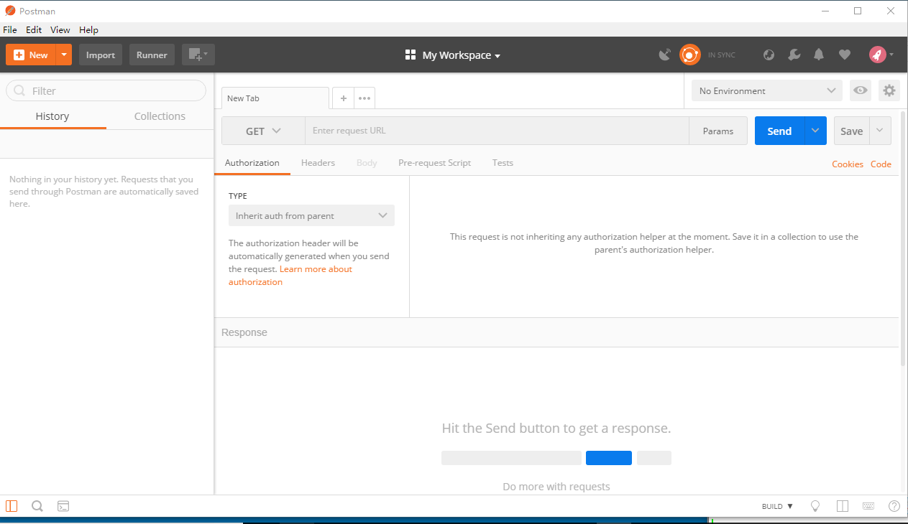

## 3.4 IDEA配置

详见   “资源\微服务资源\本地仓库\扩展文档”   

# 4 十次方工程搭建

## 4.1 搭建父工程

（1）选择菜单file-new project  ,弹出窗口中左侧菜单选择Maven   ，点击next按钮

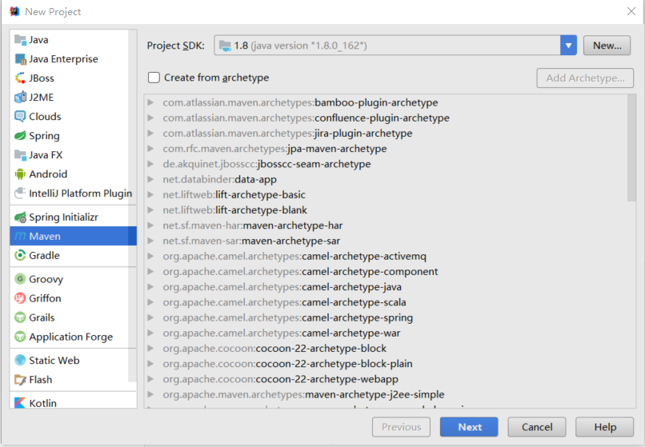

（2）填写GroupId 和ArtifacetId  ,点击next按钮

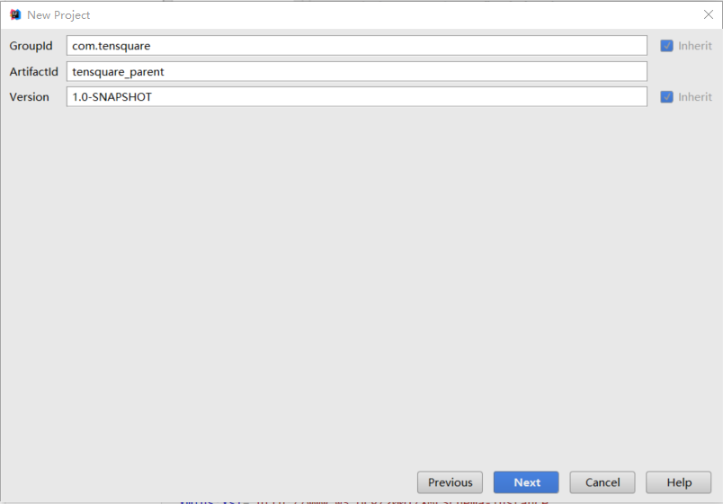

（3）点击Finish  完成

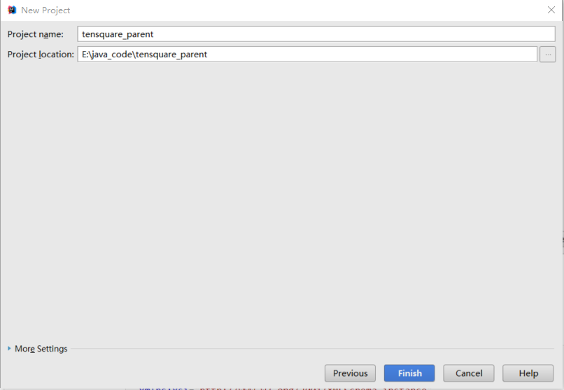

（4）删除src文件夹

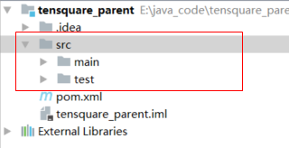

（5）修改pom.xml    添加以下配置 （资源已提供:   资源\配置文件\springboot）

```xml
    <packaging>pom</packaging>

	<name>tensquare_parent</name>
	<description>十次方项目-黑马程序员</description>

	<parent>
		<groupId>org.springframework.boot</groupId>
		<artifactId>spring-boot-starter-parent</artifactId>
		<version>2.0.1.RELEASE</version>
		<relativePath/>
	</parent>

	<properties>
		<project.build.sourceEncoding>UTF-8</project.build.sourceEncoding>
		<project.reporting.outputEncoding>UTF-8</project.reporting.outputEncoding>
		<java.version>1.8</java.version>
	</properties>

	<dependencies>
		<dependency>
			<groupId>org.springframework.boot</groupId>
			<artifactId>spring-boot-starter-web</artifactId>
		</dependency>
		<dependency>
			<groupId>org.springframework.boot</groupId>
			<artifactId>spring-boot-starter-test</artifactId>
			<scope>test</scope>
		</dependency>
	</dependencies>
	
	<repositories>
        <repository>
            <id>spring-snapshots</id>
            <name>Spring Snapshots</name>
            <url>https://repo.spring.io/snapshot</url>
            <snapshots>
                <enabled>true</enabled>
            </snapshots>
        </repository>
        <repository>
            <id>spring-milestones</id>
            <name>Spring Milestones</name>
            <url>https://repo.spring.io/milestone</url>
            <snapshots>
                <enabled>false</enabled>
            </snapshots>
        </repository>
    </repositories>

    <pluginRepositories>
        <pluginRepository>
            <id>spring-snapshots</id>
            <name>Spring Snapshots</name>
            <url>https://repo.spring.io/snapshot</url>
            <snapshots>
                <enabled>true</enabled>
            </snapshots>
        </pluginRepository>
        <pluginRepository>
            <id>spring-milestones</id>
            <name>Spring Milestones</name>
            <url>https://repo.spring.io/milestone</url>
            <snapshots>
                <enabled>false</enabled>
            </snapshots>
        </pluginRepository>
    </pluginRepositories>
```

（6）当IDEA右下角弹出提示 ,点击Enable Auto-Import  自动导入依赖 

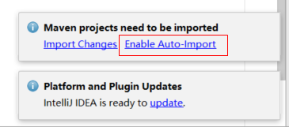

## 4.2 搭建公共子模块

### 4.2.1 搭建子模块步骤 

搭建公共子模块 tensquare_common

（1）右键点击工程，弹出菜单选择 New -Module   弹出窗口选择Maven  ,点击next按钮

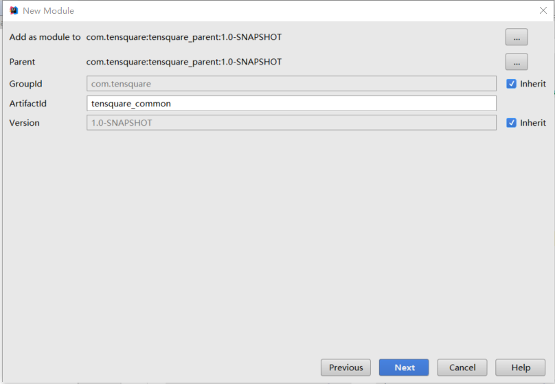

（2）点击finish

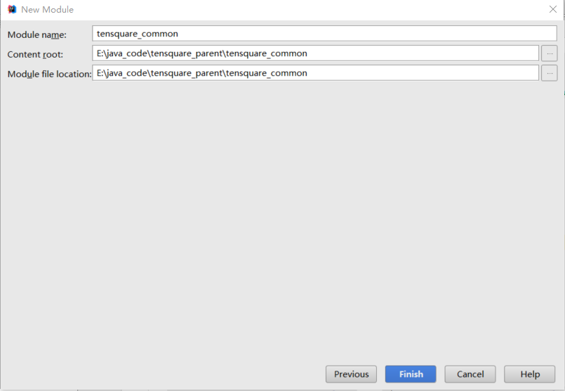

### 4.2.2 创建返回结果实体类 

（1）新建entity包，包下创建类Result，用于控制器类返回结果

```java
package entity;

public class Result {
	
    private boolean flag;//是否成功
    private Integer code;// 返回码
    private String message;//返回信息
    private Object data;// 返回数据

	public Result(boolean flag, Integer code, String message, Object data) {
		super();
		this.flag = flag;
		this.code = code;
		this.message = message;
		this.data = data;
	}

    public Result() {
    }
  
	public Result(boolean flag, Integer code, String message) {
		super();
		this.flag = flag;
		this.code = code;
		this.message = message;
	}
	
	public boolean isFlag() {
		return flag;
	}
	public void setFlag(boolean flag) {
		this.flag = flag;
	}
	public Integer getCode() {
		return code;
	}
	public void setCode(Integer code) {
		this.code = code;
	}
	public String getMessage() {
		return message;
	}
	public void setMessage(String message) {
		this.message = message;
	}
	public Object getData() {
		return data;
	}
	public void setData(Object data) {
		this.data = data;
	}
	
	
}
```

提示：IDEA 生成getter and setter的快捷键是Alt+Insert 

返回码详见设计文档

（2）创建类PageResult ，用于返回分页结果

```java
/**
 * 分页结果类
 * @param <T>
 */
public class PageResult<T> {

   private Long total;
   private List<T> rows;

   public PageResult(Long total, List<T> rows) {
      super();
      this.total = total;
      this.rows = rows;
   }
   //getter and setter ....
}
```

### 4.2.3 返回码定义类 

```java
package entity;

/**
 * 状态码实体类
 */
public class StatusCode {

    public static final int OK=20000;//成功
    public static final int ERROR =20001;//失败
    public static final int LOGINERROR =20002;//用户名或密码错误
    public static final int ACCESSERROR =20003;//权限不足
    public static final int REMOTEERROR =20004;//远程调用失败
    public static final int REPERROR =20005;//重复操作

}
```

### 4.2.4 分布式ID生成器   

​	由于我们的数据库在生产环境中要分片部署（MyCat）,所以我们不能使用数据库本身的自增功能来产生主键值，只能由程序来生成唯一的主键值。我们采用的是开源的 twitter( 非官方中文惯称：推特.是国外的一个网站，是一个社交网络及微博客服务) 的 snowflake （雪花）算法。

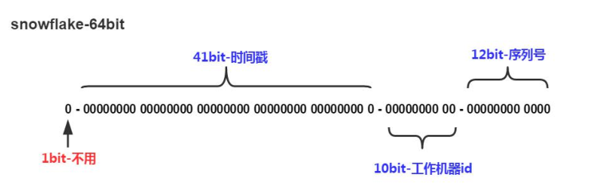

​	默认情况下41bit的时间戳可以支持该算法使用到2082年，10bit的工作机器id可以支持1024台机器，序列号支持1毫秒产生4096个自增序列id  . SnowFlake的优点是，整体上按照时间自增排序，并且整个分布式系统内不会产生ID碰撞(由数据中心ID和机器ID作区分)，并且效率较高，经测试，SnowFlake每秒能够产生26万ID左右

​	我们课程中已经提供了分布式ID生成器  

>    资源\微服务资源\工具类\IdWorker.java    

tensquare_common工程创建util包，将IdWorker.java直接拷贝到tensquare_common工程的util包中。


# 5 基础微服务-标签CRUD

## 5.1 模块搭建

（1）搭建基础微服务模块tensquare_base ,  pom.xml引入依赖

```xml
<dependency>
    <groupId>org.springframework.boot</groupId>
    <artifactId>spring-boot-starter-data-jpa</artifactId>
</dependency>
<dependency>
    <groupId>mysql</groupId>
    <artifactId>mysql-connector-java</artifactId>
</dependency>
<dependency>
    <groupId>com.tensquare</groupId>
    <artifactId>tensquare_common</artifactId>
    <version>1.0-SNAPSHOT</version>
</dependency>
```

（2）创建启动类

```java
package com.tensquare.base;
import org.springframework.boot.SpringApplication;
import org.springframework.boot.autoconfigure.SpringBootApplication;
import org.springframework.context.annotation.Bean;
import util.IdWorker;

/**
 * 启动类
 */
@SpringBootApplication
public class BaseApplication {

    public static void main(String[] args) {
        SpringApplication.run(BaseApplication.class);
    }
    
    @Bean
    public IdWorker idWorker(){
        return new IdWorker(1,1);
    }
}
```

提示：IDEA创建main方法的快捷键是 psvm  

（3）在resources下创建application.yml

```yaml
server: 
  port: 9001
spring: 
  application:  
    name: tensquare-base #指定服务名
  datasource:  
    driverClassName: com.mysql.jdbc.Driver
    url: jdbc:mysql://192.168.184.134:3306/tensquare_base?characterEncoding=utf-8
    username: root
    password: 123456
  jpa: 
    database: MySQL
    show-sql: true
    generate-ddl: true
```


## 5.2 标签管理-CRUD

### 5.2.1 表结构分析

表名称：tb_label

| 字段名称      | 字段含义 | 字段类型 | 备注         |
| --------- | ---- | ---- | ---------- |
| id        | ID   | 文本   |            |
| labelname | 标签名称 | 文本   |            |
| state     | 状态   | 文本   | 0：无效  1：有效 |
| count     | 使用数量 | 整型   |            |
| fans      | 关注数  | 整型   |            |
| recommend | 是否推荐 | 文本   | 0：不推荐 1:推荐 |

### 5.2.2 CRUD的实现

（1）实体类

创建com.tensquare.base包，包下创建pojo包 ，包下创建实体类Label 

```java
package com.tensquare.base.pojo;
import org.springframework.boot.autoconfigure.domain.EntityScan;
import javax.persistence.Entity;
import javax.persistence.Id;
import javax.persistence.Table;
/**
 * 标签实体类
 */
@Entity
@Table(name="tb_label")
public class Label {

    @Id
    private String id;//
    private String labelname;//标签名称
    private String state;//状态
    private Long count;//使用数量
    private Long fans;//关注数
    private String recommend;//是否推荐

    public String getId() {
        return id;
    }

    public void setId(String id) {
        this.id = id;
    }

    public String getLabelname() {
        return labelname;
    }

    public void setLabelname(String labelname) {
        this.labelname = labelname;
    }

    public String getState() {
        return state;
    }

    public void setState(String state) {
        this.state = state;
    }

    public Long getCount() {
        return count;
    }

    public void setCount(Long count) {
        this.count = count;
    }

    public Long getFans() {
        return fans;
    }

    public void setFans(Long fans) {
        this.fans = fans;
    }

    public String getRecommend() {
        return recommend;
    }

    public void setRecommend(String recommend) {
        this.recommend = recommend;
    }
}
```

（3）创建数据访问接口

com.tensquare.base包下创建dao包，包下创建LabelDao接口

```java
package com.tensquare.base.dao;
import com.tensquare.base.pojo.Label;
import org.springframework.data.jpa.repository.JpaRepository;
import org.springframework.data.jpa.repository.JpaSpecificationExecutor;

/**
 * 标签数据访问接口
 */
public interface LabelDao extends JpaRepository<Label,String>,JpaSpecificationExecutor<Label>{

}
```

JpaRepository提供了基本的增删改查

JpaSpecificationExecutor用于做复杂的条件查询


（4）业务逻辑类

com.tensquare.base包下创建service包，包下创建LabelService类。 在这个类中，我们实现基本的增删改查功能  

```java
package com.tensquare.base.service;
import com.tensquare.base.dao.LabelDao;
import com.tensquare.base.pojo.Label;
import org.springframework.beans.factory.annotation.Autowired;
import org.springframework.stereotype.Service;
import util.IdWorker;
import java.util.List;

/**
 * 标签业务逻辑类
 */
@Service
public class LabelService {

    @Autowired
    private LabelDao labelDao;

    @Autowired
    private IdWorker idWorker;

    /**
     * 查询全部标签
     * @return
     */
    public List<Label> findAll(){
        return labelDao.findAll();
    }

    /**
     * 根据ID查询标签
     * @return
     */
    public Label findById(String id){
        return labelDao.findById(id).get();
    }

    /**
     * 增加标签
     * @param label
     */
    public void add(Label label){
        label.setId( idWorker.nextId()+"" );//设置ID
        labelDao.save(label);
    }

    /**
     * 修改标签
     * @param label
     */
    public void update(Label label){
        labelDao.save(label);
    }

    /**
     * 删除标签
     * @param id
     */
    public void deleteById(String id){
        labelDao.deleteById(id);
    }

}
```

（5）控制器类

com.tensquare.user包下创建controller包，创建UserController

```java
package com.tensquare.base.controller;
import com.tensquare.base.pojo.Label;
import com.tensquare.base.service.LabelService;
import entity.Result;
import entity.StatusCode;
import org.springframework.beans.factory.annotation.Autowired;
import org.springframework.web.bind.annotation.*;
import java.util.List;
/**
 * 标签控制层
 */
@RestController
@RequestMapping("/label")
public class LabelController {

    @Autowired
    private LabelService labelService;

    /**
     * 查询全部列表
     * @return
     */
    @RequestMapping(method = RequestMethod.GET)
    public Result findAll(){
        int s = 1/0;
        return new Result(true, StatusCode.OK,"查询成功", labelService.findAll());
    }

    /**
     *  根据ID查询标签
     * @param id
     * @return
     */
    @RequestMapping(value="/{id}",method = RequestMethod.GET)
    public Result findById(@PathVariable String id){
        return new Result(true,StatusCode.OK,"查询成功",labelService.findById(id));
    }

    /**
     *  增加标签
     * @param label
     * @return
     */
    @RequestMapping(method = RequestMethod.POST)
    public Result add( @RequestBody Label label){
        labelService.add(label);
        return new Result(true,StatusCode.OK,"增加成功");
    }

    /**
     *  修改标签
     * @param label
     * @return
     */
    @RequestMapping(value="/{id}" ,method = RequestMethod.PUT)
    public Result update( @RequestBody Label label,@PathVariable String id){
        label.setId(id);
        labelService.update(label);
        return new Result(true,StatusCode.OK,"修改成功");
    }

    /**
     * 删除标签
     * @param id
     * @return
     */
    @RequestMapping(value="/{id}" ,method = RequestMethod.DELETE)
    public Result deleteById(@PathVariable String id){
        labelService.deleteById(id);
        return new Result(true,StatusCode.OK,"删除成功");
    }
}
```

### 5.2.3 功能测试

（1）测试查询全部数据 

使用浏览器测试GET方法  http://localhost:9001/label

（2）测试根据ID查询标签

使用浏览器测试GET方法  http://localhost:9001/label/1

（3）测试增加：

使用**postMan**工具来进行测试POST PUT DELETE等方法。

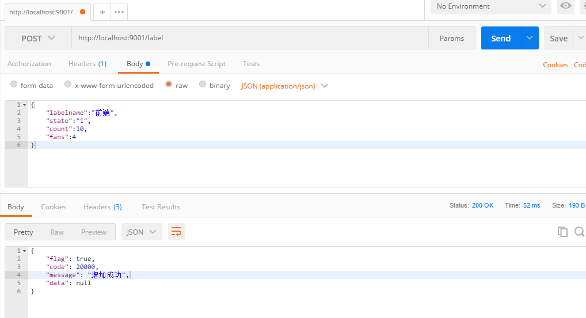

（4）测试修改

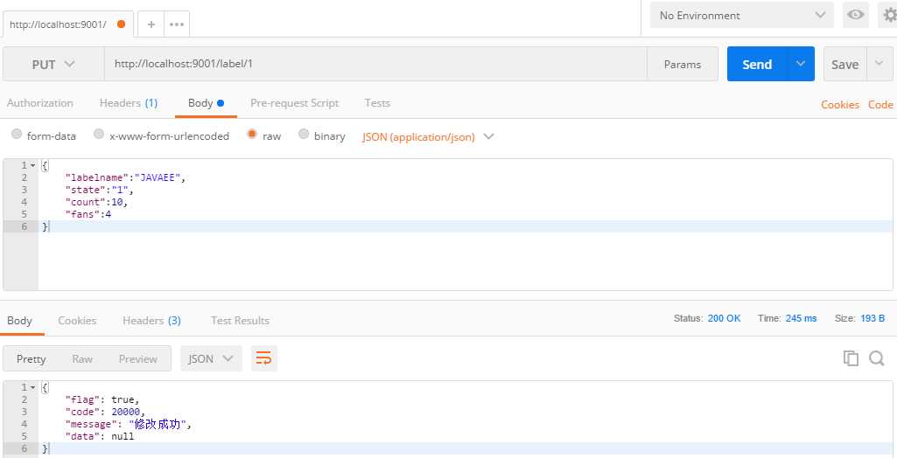

（5）测试删除

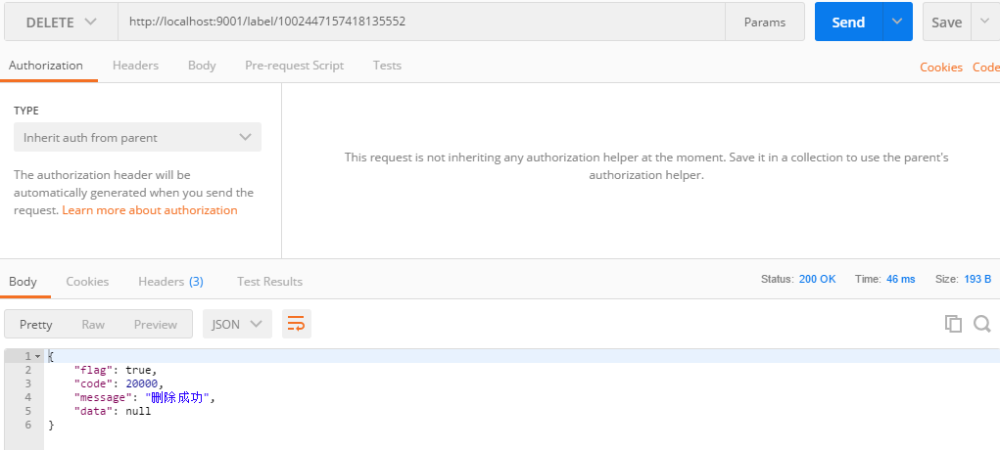

## 5.3 公共异常处理

为了使我们的代码更容易维护，我们创建一个类集中处理异常

在om.tensquare.user.controller包下创建公共异常处理类BaseExceptionHandler

```java
/**
 * 统一异常处理类
 */
@ControllerAdvice
public class BaseExceptionHandler {
	
    @ExceptionHandler(value = Exception.class)
    @ResponseBody
    public Result error( Exception e) {
        e.printStackTrace();        
        return new Result(false, StatusCode.ERROR, e.getMessage());
    }
}
```

## 5.4 跨域处理

​	跨域是什么？浏览器从一个域名的网页去请求另一个域名的资源时，域名、端口、协议任一不同，都是跨域 。我们是采用前后端分离开发的，也是前后端分离部署的，必然会存在跨域问题。  怎么解决跨域？很简单，只需要在controller类上添加注解	`@CrossOrigin`即可！这个注解其实是CORS的实现。

​	CORS(Cross-Origin Resource Sharing, 跨源资源共享)是W3C出的一个标准，其思想是使用自定义的HTTP头部让浏览器与服务器进行沟通，从而决定请求或响应是应该成功，还是应该失败。因此，要想实现CORS进行跨域，需要服务器进行一些设置，同时前端也需要做一些配置和分析。本文简单的对服务端的配置和前端的一些设置进行分析。


# 总结

## 谈谈你对Restful的理解


## 你做过的项目是不是分布式的？ID如何保证不会重复


## 你是如何实现对异常的处理


