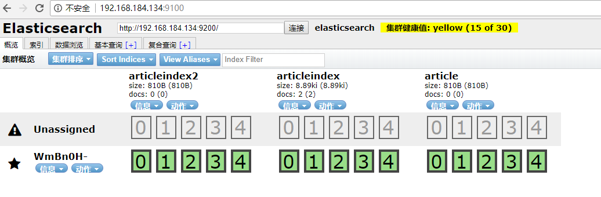
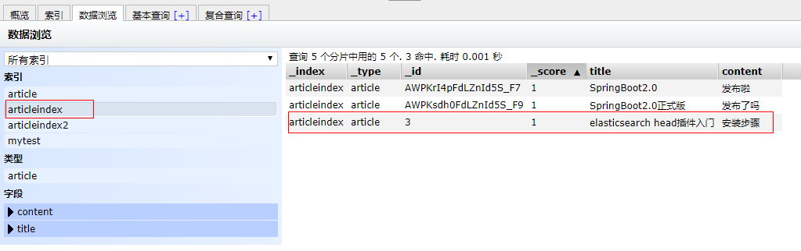
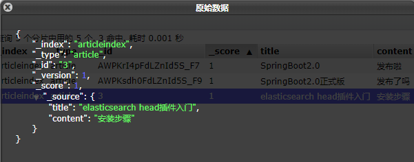
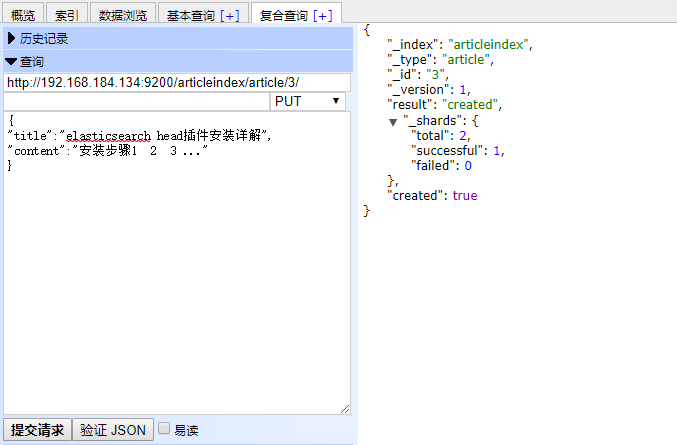
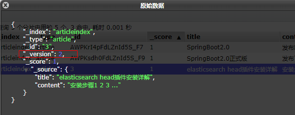
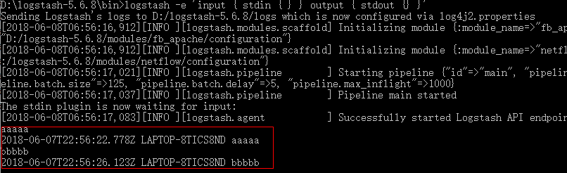
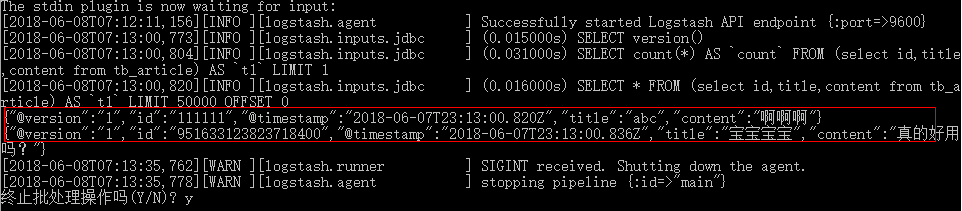

# 第4章-分布式搜索引擎ElasticSearch  

学习目标：

- 了解Elasticsearch的特点及体系结构
- 完成Elasticsearch安装，能够调用RestAPI完成基本增删改查操作
- 完成Head插件安装，熟悉Head插件的基本使用方法
- 完成IK分词器的安装，能够使用IK分词器进行分词
- 使用SpringDataElasticsearch完成搜索微服务的开发（重点）
- 使用logstash完成mysql与Elasticsearch的同步工作
- 完成Elasticsearch在docker下的安装


# 1 ElasticSearch简介

## 1.1 什么是ElasticSearch

​	Elasticsearch是一个实时的分布式搜索和分析引擎。它可以帮助你用前所未有的速度去处理大规模数据。ElasticSearch是一个基于Lucene的搜索服务器。它提供了一个分布式多用户能力的全文搜索引擎，基于RESTful web接口。Elasticsearch是用Java开发的，并作为Apache许可条款下的开放源码发布，是当前流行的企业级搜索引擎。设计用于云计算中，能够达到实时搜索，稳定，可靠，快速，安装使用方便。

## 1.2 ElasticSearch特点

（1）可以作为一个大型分布式集群（数百台服务器）技术，处理PB级数据，服务大公司；也可以运行在单机上

（2）将全文检索、数据分析以及分布式技术，合并在了一起，才形成了独一无二的ES；

（3）开箱即用的，部署简单

（4）全文检索，同义词处理，相关度排名，复杂数据分析，海量数据的近实时处理

## 1.3 ElasticSearch体系结构 

下表是Elasticsearch与MySQL数据库逻辑结构概念的对比

| Elasticsearch | 关系型数据库Mysql    |
| ------------- | -------------- |
| 索引(index)     | 数据库(databases) |
| 类型(type)      | 表(table)       |
| 文档(document)  | 行(row)         |

# 2 走进ElasticSearch

## 2.1 ElasticSearch部署与启动

下载ElasticSearch  5.6.8版本

https://www.elastic.co/downloads/past-releases/elasticsearch-5-6-8

资源\微服务资源\配套软件中也提供了安装包

无需安装，解压安装包后即可使用

在命令提示符下，进入ElasticSearch安装目录下的bin目录,执行命令

```sh
elasticsearch
```

即可启动。

我们打开浏览器，在地址栏输入http://127.0.0.1:9200/  即可看到输出结果

```json
{
  "name" : "uV2glMR",
  "cluster_name" : "elasticsearch",
  "cluster_uuid" : "RdV7UTQZT1-Jnka9dDPsFg",
  "version" : {
    "number" : "5.6.8",
    "build_hash" : "688ecce",
    "build_date" : "2018-02-16T16:46:30.010Z",
    "build_snapshot" : false,
    "lucene_version" : "6.6.1"
  },
  "tagline" : "You Know, for Search"
}
```

## 2.2 Postman调用RestAPI

### 2.2.1 新建索引

例如我们要创建一个叫articleindex的索引  ,就以put方式提交

 http://127.0.0.1:9200/articleindex/  

### 2.2.2 新建文档

新建文档：

以post方式提交  http://127.0.0.1:9200/articleindex/article 

body:  

```json
{
	"title":"SpringBoot2.0",
	"content":"发布啦"
}
```

返回结果如下：

```json
{
    "_index": "articleindex",
    "_type": "article",
    "_id": "AWPKsdh0FdLZnId5S_F9",
    "_version": 1,
    "result": "created",
    "_shards": {
        "total": 2,
        "successful": 1,
        "failed": 0
    },
    "created": true
}
```

_id是由系统自动生成的。  为了方便之后的演示，我们再次录入几条测试数据。

### 2.2.3 查询全部文档

查询某索引某类型的全部数据，以get方式请求

http://127.0.0.1:9200/articleindex/article/_search  返回结果如下：

```json
{
    "took": 5,
    "timed_out": false,
    "_shards": {
        "total": 5,
        "successful": 5,
        "skipped": 0,
        "failed": 0
    },
    "hits": {
        "total": 2,
        "max_score": 1,
        "hits": [
            {
                "_index": "articleindex",
                "_type": "article",
                "_id": "AWPKrI4pFdLZnId5S_F7",
                "_score": 1,
                "_source": {
                    "title": "SpringBoot2.0",
                    "content": "发布啦"
                }
            },
            {
                "_index": "articleindex",
                "_type": "article",
                "_id": "AWPKsdh0FdLZnId5S_F9",
                "_score": 1,
                "_source": {
                    "title": "elasticsearch入门",
                    "content": "零基础入门"
                }
            }
        ]
    }
}
```

### 2.2.4 修改文档 

以put形式提交以下地址：

http://192.168.184.134:9200/articleindex/article/AWPKrI4pFdLZnId5S_F7  

body:

```json
{
	"title":"SpringBoot2.0正式版",
	"content":"发布了吗"
}
```

返回结果：

```json
{
    "_index": "articleindex",
    "_type": "article",
    "_id": "AWPKsdh0FdLZnId5S_F9",
    "_version": 2,
    "result": "updated",
    "_shards": {
        "total": 2,
        "successful": 1,
        "failed": 0
    },
    "created": false
}
```

如果我们在地址中的ID不存在，则会创建新文档

以put形式提交以下地址：

```
http://192.168.184.134:9200/articleindex/article/1
```

body:

```json
{
	"title":"十次方课程好给力",
	"content":"知识点很多"
}
```

返回信息：

```json
{
    "_index": "articleindex",
    "_type": "article",
    "_id": "1",
    "_version": 1,
    "result": "created",
    "_shards": {
        "total": 2,
        "successful": 1,
        "failed": 0
    },
    "created": true
}
```

再次查询，看是否有新增的这条文档

### 2.2.5 按ID查询文档  

GET方式请求

```
http://192.168.184.134:9200/articleindex/article/1
```

### 2.2.6 基本匹配查询

根据某列进行查询  get方式提交下列地址：

```
http://192.168.184.134:9200/articleindex/article/_search?q=title:十次方课程好给力
```

以上为按标题查询，返回结果如下：

```json
{
    "took": 10,
    "timed_out": false,
    "_shards": {
        "total": 5,
        "successful": 5,
        "skipped": 0,
        "failed": 0
    },
    "hits": {
        "total": 1,
        "max_score": 2.0649285,
        "hits": [
            {
                "_index": "articleindex",
                "_type": "article",
                "_id": "1",
                "_score": 2.0649285,
                "_source": {
                    "title": "十次方课程好给力",
                    "content": "知识点很多"
                }
            }
        ]
    }
}
```

### 2.2.7 模糊查询

我们可以用*代表任意字符： 

```
http://192.168.184.134:9200/articleindex/article/_search?q=title:*s*
```

### 2.2.8 删除文档

根据ID删除文档,删除ID为1的文档   DELETE方式提交

```
http://192.168.184.134:9200/articleindex/article/1
```

返回结果如下：

```json
{
    "found": true,
    "_index": "articleindex",
    "_type": "article",
    "_id": "1",
    "_version": 2,
    "result": "deleted",
    "_shards": {
        "total": 2,
        "successful": 1,
        "failed": 0
    }
}
```

再次查看全部是否还存在此记录

# 3 Head插件的安装与使用

## 3.1 Head插件安装

如果都是通过rest请求的方式使用Elasticsearch，未免太过麻烦，而且也不够人性化。我们一般都会使用图形化界面来实现Elasticsearch的日常管理，最常用的就是Head插件

步骤1：

下载head插件：[https://github.com/mobz/elasticsearch-head](https://github.com/mobz/elasticsearch-head)  

配套资料中已提供。 elasticsearch-head-master.zip

步骤2：

解压到任意目录，但是要和elasticsearch的安装目录区别开。

步骤3：

安装node js  ,安装cnpm  

```
npm install -g cnpm --registry=https://registry.npm.taobao.org
```

步骤4：

将grunt安装为全局命令 。Grunt是基于Node.js的项目构建工具。它可以自动运行你所设定的任务

```sh
cnpm install -g grunt-cli
```

 步骤5：安装依赖

```
cnpm install
```

步骤6：

进入head目录启动head，在命令提示符下输入命令

```sh
grunt server
```

步骤7：

打开浏览器，输入 [http://localhost:9100](http://localhost:9100)

步骤8：

点击连接按钮没有任何相应，按F12发现有如下错误

No 'Access-Control-Allow-Origin' header is present on the requested resource

这个错误是由于elasticsearch默认不允许跨域调用，而elasticsearch-head是属于前端工程，所以报错。

我们这时需要修改elasticsearch的配置，让其允许跨域访问。

修改elasticsearch配置文件：elasticsearch.yml，增加以下两句命令：

```json
http.cors.enabled: true
http.cors.allow-origin: "*"
```

此步为允许elasticsearch跨越访问     点击连接即可看到相关信息




## 3.2 Head插件操作

### 3.2.1 新建索引

选择“索引”选项卡，点击“新建索引”按钮


输入索引名称点击OK

### 3.2.2 新建或修改文档

在复合查询中提交地址，输入内容，提交方式为PUT 

 

点击数据浏览  ,点击要查询的索引名称，右侧窗格中显示文档信息



点击文档信息：



我们再次回到刚才的界面



修改数据后重新提交请求 , 此时因为ID已经存在，所以执行的是修改操作。

重新查询此记录，发现版本为2 。也就是说每次修改后版本都会增加1.




### 3.2.3 搜索文档


### 3.2.4 删除文档

 

# 4 IK分词器

## 4.1什么是IK分词器

我们在浏览器地址栏输入http://127.0.0.1:9200/_analyze?analyzer=chinese&pretty=true&text=我是程序员，浏览器显示效果如下

```json
{
  "tokens" : [
    {
      "token" : "我",
      "start_offset" : 0,
      "end_offset" : 1,
      "type" : "<IDEOGRAPHIC>",
      "position" : 0
    },
    {
      "token" : "是",
      "start_offset" : 1,
      "end_offset" : 2,
      "type" : "<IDEOGRAPHIC>",
      "position" : 1
    },
    {
      "token" : "程",
      "start_offset" : 2,
      "end_offset" : 3,
      "type" : "<IDEOGRAPHIC>",
      "position" : 2
    },
    {
      "token" : "序",
      "start_offset" : 3,
      "end_offset" : 4,
      "type" : "<IDEOGRAPHIC>",
      "position" : 3
    },
    {
      "token" : "员",
      "start_offset" : 4,
      "end_offset" : 5,
      "type" : "<IDEOGRAPHIC>",
      "position" : 4
    }
  ]
}
```

默认的中文分词是将每个字看成一个词，这显然是不符合要求的，所以我们需要安装中文分词器来解决这个问题。

IK分词是一款国人开发的相对简单的中文分词器。虽然开发者自2012年之后就不在维护了，但在工程应用中IK算是比较流行的一款！我们今天就介绍一下IK中文分词器的使用。

## 4.2 IK分词器安装

下载地址：https://github.com/medcl/elasticsearch-analysis-ik/releases   下载5.6.8版本  课程配套资源也提供了:   资源\配套软件\elasticsearch\elasticsearch-analysis-ik-5.6.8.zip

（1）先将其解压，将解压后的elasticsearch文件夹重命名文件夹为ik 

（2）将ik文件夹拷贝到elasticsearch/plugins 目录下。

（3）重新启动，即可加载IK分词器

## 4.3 IK分词器测试

IK提供了两个分词算法ik_smart 和 ik_max_word

其中 ik_smart 为最少切分，ik_max_word为最细粒度划分

我们分别来试一下

（1）最小切分：在浏览器地址栏输入地址

http://127.0.0.1:9200/_analyze?analyzer=ik_smart&pretty=true&text=我是程序员

输出的结果为：

```json
{
  "tokens" : [
    {
      "token" : "我",
      "start_offset" : 0,
      "end_offset" : 1,
      "type" : "CN_CHAR",
      "position" : 0
    },
    {
      "token" : "是",
      "start_offset" : 1,
      "end_offset" : 2,
      "type" : "CN_CHAR",
      "position" : 1
    },
    {
      "token" : "程序员",
      "start_offset" : 2,
      "end_offset" : 5,
      "type" : "CN_WORD",
      "position" : 2
    }
  ]
}
```

（2）最细切分：在浏览器地址栏输入地址

http://127.0.0.1:9200/_analyze?analyzer=ik_max_word&pretty=true&text=我是程序员

输出的结果为：

```json
{
  "tokens" : [
    {
      "token" : "我",
      "start_offset" : 0,
      "end_offset" : 1,
      "type" : "CN_CHAR",
      "position" : 0
    },
    {
      "token" : "是",
      "start_offset" : 1,
      "end_offset" : 2,
      "type" : "CN_CHAR",
      "position" : 1
    },
    {
      "token" : "程序员",
      "start_offset" : 2,
      "end_offset" : 5,
      "type" : "CN_WORD",
      "position" : 2
    },
    {
      "token" : "程序",
      "start_offset" : 2,
      "end_offset" : 4,
      "type" : "CN_WORD",
      "position" : 3
    },
    {
      "token" : "员",
      "start_offset" : 4,
      "end_offset" : 5,
      "type" : "CN_CHAR",
      "position" : 4
    }
  ]
}
```

## 4.4 自定义词库

我们现在测试"传智播客"，浏览器的测试效果如下：

http://127.0.0.1:9200/_analyze?analyzer=ik_smart&pretty=true&text=传智播客

```json
{
  "tokens" : [
    {
      "token" : "传",
      "start_offset" : 0,
      "end_offset" : 1,
      "type" : "CN_CHAR",
      "position" : 0
    },
    {
      "token" : "智",
      "start_offset" : 1,
      "end_offset" : 2,
      "type" : "CN_CHAR",
      "position" : 1
    },
    {
      "token" : "播",
      "start_offset" : 2,
      "end_offset" : 3,
      "type" : "CN_CHAR",
      "position" : 2
    },
    {
      "token" : "客",
      "start_offset" : 3,
      "end_offset" : 4,
      "type" : "CN_CHAR",
      "position" : 3
    }
  ]
}
```

默认的分词并没有识别“传智播客”是一个词。如果我们想让系统识别“传智播客”是一个词，需要编辑自定义词库。

步骤：

（1）进入elasticsearch/plugins/ik/config目录 

（2）新建一个my.dic文件，编辑内容：

```
传智播客
```

修改IKAnalyzer.cfg.xml（在ik/config目录下）

```xml
<properties>
	<comment>IK Analyzer 扩展配置</comment>
	<!--用户可以在这里配置自己的扩展字典 -->
	<entry key="ext_dict">my.dic</entry>
	 <!--用户可以在这里配置自己的扩展停止词字典-->
	<entry key="ext_stopwords"></entry>
</properties>
```

重新启动elasticsearch,通过浏览器测试分词效果

```json
{
  "tokens" : [
    {
      "token" : "传智播客",
      "start_offset" : 0,
      "end_offset" : 4,
      "type" : "CN_WORD",
      "position" : 0
    }
  ]
}
```


# 5 搜索微服务开发

## 5.1 需求分析


## 5.2 代码编写

### 5.2.1 模块搭建

（1）创建模块tensquare_search ，pom.xml引入依赖

```xml
    <dependencies>
        <dependency>
            <groupId>org.springframework.data</groupId>
            <artifactId>spring-data-elasticsearch</artifactId>
        </dependency>
        <dependency>
            <groupId>com.tensquare</groupId>
            <artifactId>tensquare_common</artifactId>
            <version>1.0-SNAPSHOT</version>
        </dependency>
    </dependencies>
```

（2）application.yml

```yaml
server:
  port: 9007
spring:
  application:
    name: tensquare-search #指定服务名
  data:
    elasticsearch:
      cluster-nodes: 127.0.0.1:9300
```

（3）创建包com.tensquare.search ，包下创建启动类

```Java
@SpringBootApplication
public class RecruitApplication {

	public static void main(String[] args) {
		SpringApplication.run(RecruitApplication.class, args);
	}

	@Bean
	public IdWorker idWorkker(){
		return new IdWorker(1, 1);
	}	
}
```

### 5.2.2 添加文章

（1）创建实体类

创建com.tensquare.search.pojo包，包下建立类

```java
/**
 * 文章实体类
 */
@Document(indexName="tensquare",type="article")
public class Article implements Serializable{
    @Id
    private String id;//ID

    @Field(index= true ,analyzer="ik_max_word",searchAnalyzer="ik_max_word")
    private String title;//标题

    @Field(index= true ,analyzer="ik_max_word",searchAnalyzer="ik_max_word")
    private String content;//文章正文
   
    private String state;//审核状态
  
	//getter and setter ......

}
```

（2）创建数据访问接口

创建com.tensquare.search.dao包，包下建立接口

```java
/**
 * 文章数据访问层接口
 */
public interface ArticleSearchDao extends ElasticsearchRepository<Article,String> {
    
}
```

（3）创建业务逻辑类

创建com.tensquare.search.service包，包下建立类

```java
@Service
public class ArticleSearchService {

    @Autowired
    private ArticleSearchDao articleSearchDao;

    /**
     * 增加文章
     * @param article
     */
    public void add(Article article){
        articleSearchDao.save(article);
    }

}
```

（4）创建控制器类

创建com.tensquare.search.controller包，包下建立类

```java
@RestController
@CrossOrigin
@RequestMapping("/article")
public class ArticleSearchController {

    @Autowired
    private ArticleSearchService articleSearchService;

    @RequestMapping(method= RequestMethod.POST)
    public Result save(@RequestBody Article article){
        articleSearchService.save(article);
        return new Result(true, StatusCode.OK, "操作成功");
    }

}
```

### 5.2.3 文章搜索

（1）ArticleSearchRepository新增方法定义

```java
    /**
     * 检索
     * @param
     * @return
     */
    public Page<Article> findByTitleOrContentLike(String title, String content, Pageable pageable);
```

（2）ArticleSearchService新增方法

```java
public Page<Article> findByTitleLike(String keywords, int page, int size){
   PageRequest pageRequest = PageRequest.of(page-1, size);
   return articleSearchRepository.findByTitleOrContentLike(keywords,keywords, pageRequest);  
}
```

（3）ArticleSearchController方法

```java
@RequestMapping(value="/search/{keywords}/{page}/{size}",method= RequestMethod.GET)
public Result findByTitleLike(@PathVariable String keywords, @PathVariable int page, @PathVariable int size){
        Page<Article> articlePage = articleSearchService.findByTitleLike(keywords,page,size);
        return new Result(true, StatusCode.OK, "查询成功",
                new PageResult<Article>(articlePage.getTotalElements(), articlePage.getContent()));
}
```


# 6 elasticsearch与MySQL数据同步

## 6.1 Logstash

### 6.1.1什么是Logstash

Logstash是一款轻量级的日志搜集处理框架，可以方便的把分散的、多样化的日志搜集起来，并进行自定义的处理，然后传输到指定的位置，比如某个服务器或者文件。

### 6.1.2 Logstash安装与测试

解压，进入bin目录

```
logstash -e 'input { stdin { } } output { stdout {} }'
```

控制台输入字符，随后就有日志输出



stdin，表示输入流，指从键盘输入

stdout，表示输出流，指从显示器输出

命令行参数: 

-e 执行 

--config 或 -f 配置文件，后跟参数类型可以是一个字符串的配置或全路径文件名或全路径路径(如：/etc/logstash.d/，logstash会自动读取/etc/logstash.d/目录下所有*.conf 的文本文件，然后在自己内存里拼接成一个完整的大配置文件再去执行)

## 6.2 MySQL数据导入Elasticsearch 

（1）在logstash-5.6.8安装目录下创建文件夹mysqletc （名称随意）

（2）文件夹下创建mysql.conf  （名称随意） ，内容如下：

```
input {
  jdbc {
	  # mysql jdbc connection string to our backup databse  后面的test对应mysql中的test数据库
	  jdbc_connection_string => "jdbc:mysql://127.0.0.1:3306/tensquare_article?characterEncoding=UTF8"
	  # the user we wish to excute our statement as
	  jdbc_user => "root"
	  jdbc_password => "123456"
	  # the path to our downloaded jdbc driver  
	  jdbc_driver_library => "D:/logstash-5.6.8/mysqletc/mysql-connector-java-5.1.46.jar"
	  # the name of the driver class for mysql
	  jdbc_driver_class => "com.mysql.jdbc.Driver"
	  jdbc_paging_enabled => "true"
	  jdbc_page_size => "50000"
	  #以下对应着要执行的sql的绝对路径。
	  statement => "select id,title,content from tb_article"
	  #定时字段 各字段含义（由左至右）分、时、天、月、年，全部为*默认含义为每分钟都更新
      schedule => "* * * * *"
  }
}

output {
  elasticsearch {
	  #ESIP地址与端口
	  hosts => "localhost:9200" 
	  #ES索引名称（自己定义的）
	  index => "tensquare"
	  #自增ID编号
	  document_id => "%{id}"
	  document_type => "article"
  }
  stdout {
      #以JSON格式输出
      codec => json_lines
  }
}
```

（3）将mysql驱动包mysql-connector-java-5.1.46.jar拷贝至D:/logstash-5.6.8/mysqletc/ 下 。D:/logstash-5.6.8是你的安装目录

（4）命令行下执行

```
logstash -f ../mysqletc/mysql.conf
```

观察控制台输出，每间隔1分钟就执行一次sql查询。



再次刷新elasticsearch-head的数据显示，看是否也更新了数据。

# 7 Elasticsearch Docker环境下安装

## 7.1 容器的创建与远程连接

（1）下载镜像（此步省略）

```
docker pull elasticsearch:5.6.8
```

（2）创建容器

```
docker run -di --name=tensquare_elasticsearch -p 9200:9200 -p 9300:9300 elasticsearch:5.6.8
```

（3）浏览器输入地址：

http://192.168.184.134:9200/  即可看到如下信息

```json
{
  "name" : "WmBn0H-",
  "cluster_name" : "elasticsearch",
  "cluster_uuid" : "2g-VVbm9Rty7J4sksZNJEg",
  "version" : {
    "number" : "5.6.8",
    "build_hash" : "688ecce",
    "build_date" : "2018-02-16T16:46:30.010Z",
    "build_snapshot" : false,
    "lucene_version" : "6.6.1"
  },
  "tagline" : "You Know, for Search"
}
```

（4）我们修改demo的application.yml

```yaml
 spring:
  data:
    elasticsearch:
      cluster-nodes: 192.168.184.135:9300
```

（5）运行测试程序，发现会报如下错误

```
NoNodeAvailableException[None of the configured nodes are available: [{#transport#-1}{exvgJLR-RlCNMJy-hzKtnA}{192.168.184.135}{192.168.184.135:9300}]
]
	at org.elasticsearch.client.transport.TransportClientNodesService.ensureNodesAreAvailable(TransportClientNodesService.java:347)
	at org.elasticsearch.client.transport.TransportClientNodesService.execute(TransportClientNodesService.java:245)
	at org.elasticsearch.client.transport.TransportProxyClient.execute(TransportProxyClient.java:59)
```

这是因为elasticsearch从5版本以后默认不开启远程连接，需要修改配置文件

（6）我们进入容器

```
docker exec -it tensquare_elasticsearch  /bin/bash
```

此时，我们看到elasticsearch所在的目录为/usr/share/elasticsearch  ,进入config看到了配置文件

elasticsearch.yml

我们通过vi命令编辑此文件，尴尬的是容器并没有vi命令 ，咋办？我们需要以文件挂载的方式创建容器才行，这样我们就可以通过修改宿主机中的某个文件来实现对容器内配置文件的修改

（7）拷贝配置文件到宿主机  

首先退出容器，然后执行命令：

```
docker cp tensquare_elasticsearch:/usr/share/elasticsearch/config/elasticsearch.yml /usr/share/elasticsearch.yml
```

（8）停止和删除原来创建的容器

```
docker stop tensquare_elasticsearch 
docker rm  tensquare_elasticsearch
```

（9）重新执行创建容器命令

```
docker run -di --name=tensquare_elasticsearch -p 9200:9200 -p 9300:9300 -v /usr/share/elasticsearch.yml:/usr/share/elasticsearch/config/elasticsearch.yml elasticsearch:5.6.8
```

（10）修改/usr/share/elasticsearch.yml   将`transport.host: 0.0.0.0`前的#去掉后保存文件退出。其作用是允许任何ip地址访问elasticsearch  .开发测试阶段可以这么做，生产环境下指定具体的IP 

（11）重启启动

```
docker restart tensquare_elasticsearch
```

重启后发现重启启动失败了，这时什么原因呢？这与我们刚才修改的配置有关，因为elasticsearch在启动的时候会进行一些检查，比如最多打开的文件的个数以及虚拟内存区域数量等等，如果你放开了此配置，意味着需要打开更多的文件以及虚拟内存，所以我们还需要系统调优。

（12）系统调优

我们一共需要修改两处

修改/etc/security/limits.conf  ，追加内容

```
* soft nofile 65536
* hard nofile 65536
```

nofile是单个进程允许打开的最大文件个数     soft nofile 是软限制  hard nofile是硬限制

修改/etc/sysctl.conf，追加内容

```
vm.max_map_count=655360
```

限制一个进程可以拥有的VMA(虚拟内存区域)的数量

执行下面命令    修改内核参数马上生效

```
sysctl -p
```

（13）重新启动虚拟机，再次启动容器，发现已经可以启动并远程访问


## 7.2 IK分词器安装

（1）快捷键alt+p进入sftp , 将ik文件夹上传至宿主机

```
sftp> put -r d:\setup\ik
```

（2）在宿主机中将ik文件夹拷贝到容器内 /usr/share/elasticsearch/plugins 目录下。

```
docker cp ik tensquare_elasticsearch:/usr/share/elasticsearch/plugins/
```

（3）重新启动，即可加载IK分词器

```
docker restart tensquare_elasticsearch
```

## 7.3 HEAD插件安装

（1）修改/usr/share/elasticsearch.yml ,添加允许跨域配置

```
http.cors.enabled: true
http.cors.allow-origin: "*"
```

（2）重新启动elasticseach容器

（3）下载head镜像（此步省略）

```
docker pull mobz/elasticsearch‐head:5
```

（4）创建head容器

```
docker run -di --name=myhead -p 9100:9100 docker pull mobz/elasticsearch‐head:5
```


# 面试问题总结

## 你在项目中如何开发搜索模块

elasticsearch   Spring DataElasticsearch


## 你如何实现数据库与索引库的同步？

十次方项目


## 你如何实现索引库的分词

IK    两种算法  最少切分 最细切分


## Solr 和Elasticsearch性能区分

https://www.cnblogs.com/chowmin/articles/4629220.html

