# 第5章-消息中间件RabbitMQ  

学习目标：

- 能够说出消息队列的应用场景以及RabbitMQ的主要概念
- 完成RabbitMQ安装以及RabbitMQ三种模式的入门案例
- 完成用户注册，能够将消息发送给RabbitMQ
- 完成短信微服务，能够接收消息并调用阿里云通信完成短信发送


# 1 RabbitMQ简介

## 1.1消息队列中间件简介

​	消息队列中间件是分布式系统中重要的组件，主要解决应用耦合，异步消息，流量削锋等问题实现高性能，高可用，可伸缩和最终一致性[架构]   使用较多的消息队列有ActiveMQ，RabbitMQ，ZeroMQ，Kafka，MetaMQ，RocketMQ

以下介绍消息队列在实际应用中常用的使用场景：异步处理，应用解耦，流量削锋和消息通讯四个场景


## 1.2什么是RabbitMQ

RabbitMQ 是一个由 Erlang 语言开发的 AMQP 的开源实现。

AMQP ：Advanced Message Queue，高级消息队列协议。它是应用层协议的一个开放标准，为面向消息的中间件设计，基于此协议的客户端与消息中间件可传递消息，并不受产品、开发语言等条件的限制。

RabbitMQ 最初起源于金融系统，用于在分布式系统中存储转发消息，在易用性、扩展性、高可用性等方面表现不俗。具体特点包括：

1.可靠性（Reliability）

RabbitMQ 使用一些机制来保证可靠性，如持久化、传输确认、发布确认。

2.灵活的路由（Flexible Routing）

在消息进入队列之前，通过 Exchange 来路由消息的。对于典型的路由功能，RabbitMQ 已经提供了一些内置的 Exchange 来实现。针对更复杂的路由功能，可以将多个 Exchange 绑定在一起，也通过插件机制实现自己的 Exchange 。

3.消息集群（Clustering）

多个 RabbitMQ 服务器可以组成一个集群，形成一个逻辑 Broker 。

4.高可用（Highly Available Queues）

队列可以在集群中的机器上进行镜像，使得在部分节点出问题的情况下队列仍然可用。

5.多种协议（Multi-protocol）

RabbitMQ 支持多种消息队列协议，比如 STOMP、MQTT 等等。

6.多语言客户端（Many Clients）

RabbitMQ 几乎支持所有常用语言，比如 Java、.NET、Ruby 等等。

7.管理界面（Management UI）

RabbitMQ 提供了一个易用的用户界面，使得用户可以监控和管理消息 Broker 的许多方面。

8.跟踪机制（Tracing）

如果消息异常，RabbitMQ 提供了消息跟踪机制，使用者可以找出发生了什么。

9.插件机制（Plugin System）

RabbitMQ 提供了许多插件，来从多方面进行扩展，也可以编写自己的插件。

## 1.3架构图与主要概念

### 1.3.1架构图

Exchange:交换器

RoutingKey:通俗理解“消息队列名称”


### 1.3.2主要概念

**RabbitMQ Server：** 也叫broker server，它是一种传输服务。 他的角色就是维护一条从Producer到Consumer的路线，保证数据能够按照指定的方式进行传输。

**Producer：** 消息生产者，如图A、B、C，数据的发送方。消息生产者连接RabbitMQ服务器然后将消息投递到Exchange。

**Consumer：**消息消费者，如图1、2、3，数据的接收方。消息消费者订阅队列，RabbitMQ将Queue中的消息发送到消息消费者。

**Exchange：**生产者将消息发送到Exchange（交换器），由Exchange将消息路由到一个或多个Queue中（或者丢弃）。Exchange并不存储消息。RabbitMQ中的Exchange有direct、fanout、topic、headers四种类型，每种类型对应不同的路由规则。

**Queue：**（队列）是RabbitMQ的内部对象，用于存储消息。消息消费者就是通过订阅队列来获取消息的，RabbitMQ中的消息都只能存储在Queue中，生产者生产消息并最终投递到Queue中，消费者可以从Queue中获取消息并消费。多个消费者可以订阅同一个Queue，这时Queue中的消息会被平均分摊给多个消费者进行处理，而不是每个消费者都收到所有的消息并处理。

**RoutingKey：**生产者在将消息发送给Exchange的时候，一般会指定一个routing key，来指定这个消息的路由规则，而这个routing key需要与Exchange Type及binding key联合使用才能最终生效。在Exchange Type与binding key固定的情况下（在正常使用时一般这些内容都是固定配置好的），我们的生产者就可以在发送消息给Exchange时，通过指定routing key来决定消息流向哪里。RabbitMQ为routing key设定的长度限制为255 bytes。

**Connection： （连接）**：Producer和Consumer都是通过TCP连接到RabbitMQ Server的。以后我们可以看到，程序的起始处就是建立这个TCP连接。

**Channels： （信道）**：它建立在上述的TCP连接中。数据流动都是在Channel中进行的。也就是说，一般情况是程序起始建立TCP连接，第二步就是建立这个Channel。

**VirtualHost：**权限控制的基本单位，一个VirtualHost里面有若干Exchange和MessageQueue，以及指定被哪些user使用


# 2 走进RabbitMQ

## 2.1 RabbitMQ安装与启动

### 2.1.1 windows环境下的安装

（1）下载并安装[ Eralng](http://http//www.erlang.org/downloads)

配套软件中已提供otp_win64_20.2.exe   （以管理员身份运行安装）

（2）下载并安装rabbitmq

配套软件中已提供rabbitmq-server-3.7.4.exe。双击安装，注意不要安装在包含中文和空格的目录下！安装后window服务中就存在rabbitMQ了，并且是启动状态。

（3）安装管理界面（插件）

进入rabbitMQ安装目录的sbin目录，输入命令

```
rabbitmq-plugins enable rabbitmq_management
```

（4）重新启动服务

（5）打开浏览器，地址栏输入http://127.0.0.1:15672  ,即可看到管理界面的登陆页


输入用户名和密码，都为guest  进入主界面：


最上侧的导航以此是：概览、连接、信道、交换器、队列、用户管理 

### 2.1.2 docker环境下的安装

（1）下载镜像：（此步省略）

```
docker pull rabbitmq:management
```

（2）创建容器，rabbitmq需要有映射以下端口:  5671   5672  4369  15671   15672   25672 

- 15672 (if management plugin is enabled)
- 15671  management监听端口


- 5672, 5671 (AMQP 0-9-1 without and with TLS)
- 4369 (epmd)   epmd  代表 Erlang 端口映射守护进程
- 25672 (Erlang distribution)

```
docker run -di --name=tensquare_rabbitmq -p 5671:5671 -p 5672:5672 -p 4369:4369 -p 15671:15671 -p 15672:15672 -p 25672:25672 镜像id
```

浏览器访问   http://192.168.184.134:15672/#/

## 2.2 直接模式（Direct）

### 2.2.1 什么是Direct模式

我们需要将消息发给唯一一个节点时使用这种模式，这是最简单的一种形式。

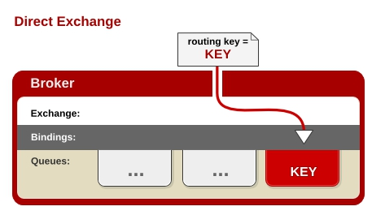 

任何发送到Direct Exchange的消息都会被转发到RouteKey中指定的Queue。

1.一般情况可以使用rabbitMQ自带的Exchange：”"(该Exchange的名字为空字符串，下文称其为default Exchange)。

2.这种模式下不需要将Exchange进行任何绑定(binding)操作

3.消息传递时需要一个“RouteKey”，可以简单的理解为要发送到的队列名字。

4.如果vhost中不存在RouteKey中指定的队列名，则该消息会被抛弃。

### 2.2.2 创建队列

做下面的例子前，我们先建立一个叫itcast的队列。

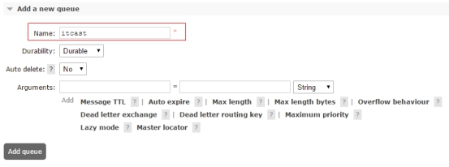 

Durability：是否做持久化   Durable（持久）     transient（临时）

Auto delete : 是否自动删除

### 2.2.3 代码实现-消息生产者

（1）创建工程rabbitmq_demo，引入amqp起步依赖 ，pom.xml如下：

```xml
	<parent>
		<groupId>org.springframework.boot</groupId>
		<artifactId>spring-boot-starter-parent</artifactId>
		<version>2.0.1.RELEASE</version>
		<relativePath/> 
	</parent>
	<properties>
		<project.build.sourceEncoding>UTF-8</project.build.sourceEncoding>
		<project.reporting.outputEncoding>UTF-8</project.reporting.outputEncoding>
		<java.version>1.8</java.version>
	</properties>

	<dependencies>
		<dependency>
			<groupId>org.springframework.boot</groupId>
			<artifactId>spring-boot-starter-amqp</artifactId>
		</dependency>
		<dependency>
			<groupId>org.springframework.boot</groupId>
			<artifactId>spring-boot-starter-test</artifactId>
			<scope>test</scope>
		</dependency>
	</dependencies>
```

（2）编写配置文件application.yml

```yaml
spring:
  rabbitmq:
    host: 192.168.184.134
```

（3）编写启动类

```java
@SpringBootApplication
public class Application {
    public static void main(String[] args) {
        SpringApplication.run(Application.class);
    }
}
```

（4）编写测试类

```java
@RunWith(SpringRunner.class)
@SpringBootTest(classes=Application.class)
public class MqTest {

    @Autowired
    private RabbitTemplate rabbitTemplate;

    @Test
    public void testSend(){
        rabbitTemplate.convertAndSend("itcast","我要红包");
    }
}
```

运行测试方法

### 2.2.4 代码实现-消息消费者

（1）编写消息消费者类

```java
@Component
@RabbitListener(queues="itcast" )
public class Customer1 {

    @RabbitHandler
    public void showMessage(String message){
        System.out.println("itcast接收到消息："+message);
    }
}
```

（2）运行启动类，可以在控制台看到刚才发送的消息

### 2.2.5 测试

开启多个消费者工程，测试运行消息生产者工程，会发现只有一个消费者工程可以接收到消息。

如何在IDEA中多次启动同一个程序呢？

（1）选择IDEA右上角的类名称按钮


（2）选择Edit Configurations 

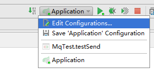

（3）在弹出窗口中取消单例模式  ，点击OK

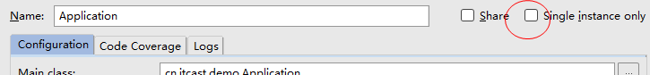

（4）每次运行前修改application.yml，指定不同的端口

```
server:
  port: 9202
```

运行后在控制台可以看到多个窗口

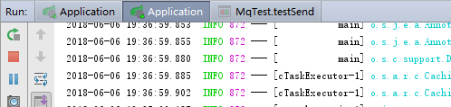


## 2.3 分列模式（Fanout）

### 2.3.1 什么是分列（Fanout）模式

当我们需要将消息一次发给多个队列时，需要使用这种模式。如下图：

 

任何发送到Fanout Exchange的消息都会被转发到与该Exchange绑定(Binding)的所有Queue上。

1.可以理解为路由表的模式

2.这种模式不需要RouteKey

3.这种模式需要提前将Exchange与Queue进行绑定，一个Exchange可以绑定多个Queue，一个Queue可以同多个Exchange进行绑定。

4.如果接受到消息的Exchange没有与任何Queue绑定，则消息会被抛弃。

### 2.3.2 交换器绑定队列

（1）在queue中添加队列itheima 和kudingyu   

（2）新建交换器chuanzhi

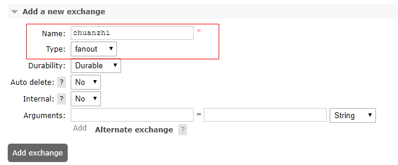

（3）将itcast 和itheima两个队列绑定到交换器chuanzhi

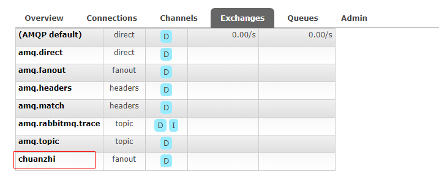

点击chuanzhi进入交换器管理界面

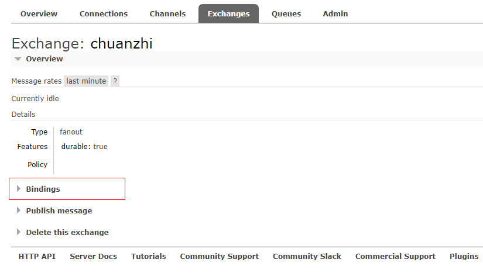

   点击Bindings添加绑定  itheima和kudingyu

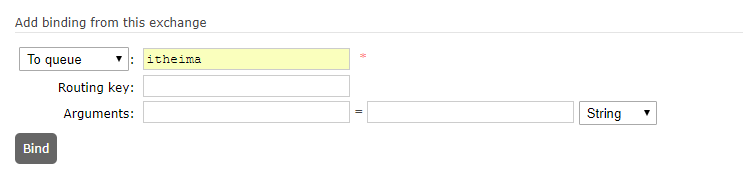 绑定后效果如下：

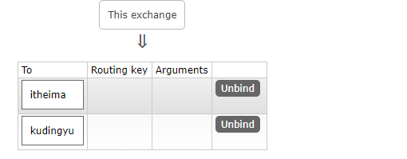

### 2.3.3 代码实现-消息生产者

```java
	@Test
	public void testSendFanout(){
		rabbitTemplate.convertAndSend("chuanzhi","", "分列模式走起");
	}
```

### 2.3.4 代码实现-消息消费者

创建消息监听类，用于监听itheima的消息

```java
@Component
@RabbitListener(queues="itheima" )
public class Customer2 {
    @RabbitHandler
    public void showMessage(String message){
        System.out.println("itheima接收到消息："+message);
    }
}
```

创建消息监听类，用于监听kudingyu的消息

```java
@Component
@RabbitListener(queues="kudingyu" )
public class Customer3 {
    @RabbitHandler
    public void showMessage(String message){
        System.out.println("kudingyu接收到消息："+message);
    }
}
```

### 2.3.5 测试

启动消费者工程，发送消息测试

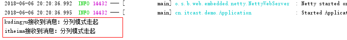

## 2.4 主题模式（Topic）

### 2.4.1 什么是主题模式

任何发送到Topic Exchange的消息都会被转发到所有关心RouteKey中指定话题的Queue上

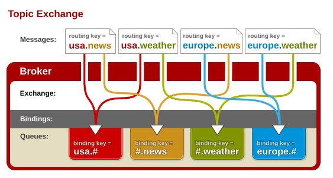

如上图所示 
此类交换器使得来自不同的源头的消息可以到达一个对列，其实说的更明白一点就是模糊匹配的意思，例如：上图中红色对列的routekey为usa.#，#代表匹配任意字符，但是要想消息能到达此对列，usa.必须匹配后面的#好可以随意。图中usa.news usa.weather,都能找到红色队列，符号`#`匹配一个或多个词，符号`*`匹配不多不少一个词。因此`usa.#`能够匹配到`usa.news.XXX`，但是`usa.*`只会匹配到`usa.XXX`。 
注： 
交换器说到底是一个名称与队列绑定的列表。当消息发布到交换器时，实际上是由你所连接的信道，将消息路由键同交换器上绑定的列表进行比较，最后路由消息。

**任何发送到Topic Exchange的消息都会被转发到所有关心RouteKey中指定话题的Queue上**

1.这种模式较为复杂，简单来说，就是每个队列都有其关心的主题，所有的消息都带有一个“标题”(RouteKey)，Exchange会将消息转发到所有关注主题能与RouteKey模糊匹配的队列。

2.这种模式需要RouteKey，也许要提前绑定Exchange与Queue。

3.在进行绑定时，要提供一个该队列关心的主题，如“#.log.#”表示该队列关心所有涉及log的消息(一个RouteKey为”MQ.log.error”的消息会被转发到该队列)。

4.“#”表示0个或若干个关键字，“*”表示一个关键字。如“log.*”能与“log.warn”匹配，无法与“log.warn.timeout”匹配；但是“log.#”能与上述两者匹配。

5.同样，如果Exchange没有发现能够与RouteKey匹配的Queue，则会抛弃此消息


### 2.4.2 创建队列与绑定

（1）新建一个交换器   ，类型选择topic

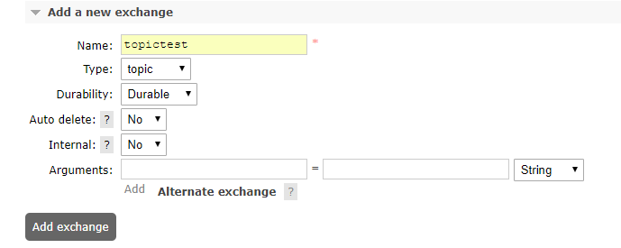

（2）点击新建的交换器topictest 

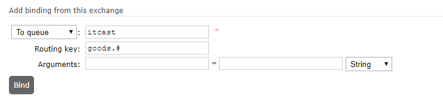

添加匹配规则，添加后列表如下：

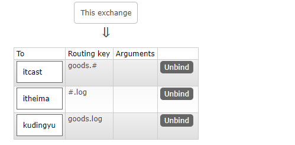

### 2.4.3 代码实现

编写测试类方法：

```java
    @Test
    public void testSendTopic1(){
        rabbitTemplate.convertAndSend("topictest","goods.aaa","主题模式");
    }
```

输出结果：itcast接收到消息：主题模式

```java
    @Test
    public void testSendTopic2(){
        rabbitTemplate.convertAndSend("topictest","article.content.log","主题模式");
    }
```

输出结果：itheima接收到消息：主题模式

```java
    @Test
    public void testSendTopic3(){
        rabbitTemplate.convertAndSend("topictest","goods.log","主题模式");
    }
```

输出结果：

itheima接收到消息：主题模式
itcast接收到消息：主题模式
kudingyu接收到消息：主题模式

# 3 用户微服务-用户注册

## 3.1 需求分析

注册账号，用手机号注册，填写后发送短信验证码，填写短信验证码正确方可注册成功。

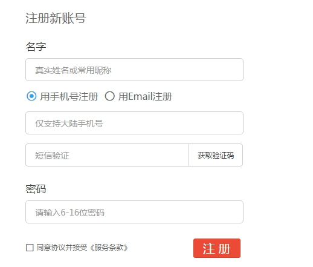 

我们这里所做的实际上就是消息生产者。

## 3.2 代码生成

（1）使用代码生成器生成用户微服务代码 tensquare_user

（2）拷贝到当前工程，并在父工程引入。

（3）修改Application类名称为UserApplication

（4）修改application.yml 中的端口为9008  ,url 为

```
jdbc:mysql://192.168.184.134:3306/tensquare_user?characterEncoding=UTF8
```

（5）进行浏览器测试

## 3.3 发送短信验证码

实现思路： 在用户微服务编写API ,生成手机验证码，存入Redis并发送到RabbitMQ

### 3.3.1 准备工作 

（1）因为要用到缓存和消息队列，所以在用户微服务（tensquare_user）引入依赖redis和amqp的起步依赖。

```xml
		<dependency>
			<groupId>org.springframework.boot</groupId>
			<artifactId>spring-boot-starter-data-redis</artifactId>
		</dependency>
		<dependency>  
			<groupId>org.springframework.boot</groupId>  
			<artifactId>spring-boot-starter-amqp</artifactId>  
		</dependency>
```

（2）修改application.yml ,在spring 节点下添加配置

```yaml
  redis:
    host: 192.168.184.134
  rabbitmq:
    host: 192.168.184.134
```

### 3.3.2 代码实现

（1）在UserService中新增方法，用于发送短信验证码

```java
	@Autowired
	private RedisTemplate redisTemplate;

	@Autowired
	private RabbitTemplate rabbitTemplate;

	/**
	 * 发送短信验证码
	 * @param mobile 手机号
	 */
	public void sendSms(String mobile){
		//1.生成6位短信验证码
		Random random=new Random();
		int max=999999;//最大数
		int min=100000;//最小数
		int code = random.nextInt(max);//随机生成
		if(code<min){
			code=code+min;
		}
		System.out.println(mobile+"收到验证码是："+code);
		//2.将验证码放入redis
		redisTemplate.opsForValue().set("smscode_"+mobile, code+"" ,5, TimeUnit.MINUTES );//五分钟过期

		//3.将验证码和手机号发动到rabbitMQ中
		Map<String,String> map=new HashMap();
		map.put("mobile",mobile);
		map.put("code",code+"");
		rabbitTemplate.convertAndSend("sms",map);
	}
```

（2）UserController新增方法

```java
	/**
	 * 发送短信验证码
	 * @param mobile
	 */
	@RequestMapping(value="/sendsms/{mobile}",method=RequestMethod.POST)
	public Result sendsms(@PathVariable String mobile ){
		userService.sendSms(mobile);
		return new Result(true,StatusCode.OK,"发送成功");
	}
```

（3）启动微服务，在rabbitMQ中创建名为sms的队列，测试API 


## 3.3 用户注册

（1）UserService增加方法

```java
	/**
	 * 增加
	 * @param user 用户
	 * @param code 用户填写的验证码
	 */
	public void add(User user,String code) {
		//判断验证码是否正确
		String syscode = (String)redisTemplate.opsForValue().get("smscode_" + user.getMobile()); //提取系统正确的验证码
		if(syscode==null){
			throw new RuntimeException("请点击获取短信验证码");
		}
		if(!syscode.equals(code)){
			throw new RuntimeException("验证码输入不正确");
		}

		user.setId( idWorker.nextId()+"" );
		user.setFollowcount(0);//关注数
		user.setFanscount(0);//粉丝数
		user.setOnline(0L);//在线时长
		user.setRegdate(new Date());//注册日期
		user.setUpdatedate(new Date());//更新日期
		user.setLastdate(new Date());//最后登陆日期

		userDao.save(user);
	}
```

（2）UserController增加方法

```java
	/**
	 * 用户注册
	 * @param user
	 */
	@RequestMapping(value="/register/{code}",method=RequestMethod.POST)
	public Result register( @RequestBody User user  ,@PathVariable String code){
		userService.add(user,code);
		return new Result(true,StatusCode.OK,"注册成功");
	}
```

（3）测试

# 4 短信微服务

## 4.1 需求分析

​	开发短信发送微服务，从rabbitMQ中提取消息，调用阿里大于短信接口实现短信发送 。（关于短信阿里大于，我们在前面的电商项目中已经讲解过，故账号申请等环节略过）

    	我们这里实际做的就是消息的消费者.

## 4.2 提取队列中的消息

### 4.2.1 工程搭建

（1）创建工程模块：tensquare_sms，pom.xml引入依赖

```xml
  	<dependency>  
		<groupId>org.springframework.boot</groupId>  
		<artifactId>spring-boot-starter-amqp</artifactId>  
	</dependency> 
```

（2）创建application.yml

```yaml
server: 
  port: 9009
spring: 
  application:  
    name: tensquare-sms #指定服务名
  rabbitmq: 
    host: 192.168.184.134
```

（3）com.tensquare.sms 包下创建启动类

```java
@SpringBootApplication
public class SmsApplication {
	public static void main(String[] args) {
		SpringApplication.run(SmsApplication.class, args);
	}
}
```


### 4.2.2 消息监听类

（1）创建短信监听类，获取手机号和验证码

```java
/**
 * 短信监听类
 */
@Component
@RabbitListener(queues = "sms")
public class SmsListener {

    /**
     *  发送短信
     * @param message
     */
    @RabbitHandler
    public void sendSms(Map<String,String> message){
        System.out.println("手机号："+message.get("mobile"));
        System.out.println("验证码："+message.get("code"));
    }

}
```

（2）运行SmsApplication类，控制台显示手机号和验证码

## 4.3 发送短信(阿里云通信)

### 4.3.1 阿里云通信简介

​        阿里云通信（原名--阿里大于）是 阿里云旗下产品，融合了三大运营商的通信能力，通过将传统通信业务和能力与互联网相结合，创新融合阿里巴巴生态内容，全力为中小企业和开发者提供优质服务阿里大于提供包括短信、语音、流量直充、私密专线、店铺手机号等个性化服务。通过阿里大于打通三大运营商通信能力，全面融合阿里巴巴生态，以开放 API 及 SDK 的方式向开发者提供通信和数据服务，更好地支撑企业业务发展和创新服务。

### 4.3.2 准备工作

（1）在阿里云官网  www.alidayu.com 注册账号

（2）手机下载”阿里云“APP，完成实名认证

（3）登陆阿里云，产品中选择”短信服务“

（4）申请签名

（5）申请模板

（6）创建 accessKey （注意保密！）

（7）充值  （没必要充太多，1至2元足矣，土豪请随意~）

### 4.3.3 代码编写

（1）创建工程模块tensquare_sms，pom.xml引入依赖

```xml
	<dependency>
   		<groupId>com.aliyun</groupId>
   		<artifactId>aliyun-java-sdk-dysmsapi</artifactId>
   		<version>1.0.0-SNAPSHOT</version>
   	</dependency>
   	<dependency> 
   		<groupId>com.aliyun</groupId>
   		<artifactId>aliyun-java-sdk-core</artifactId>
   		<version>3.2.5</version>
   	</dependency>  
```

（2）修改application.yml ，增加配置

```yaml
aliyun: 
  sms: 
    accessKeyId: LTAIKwFq9lPHwLvh
    accessKeySecret: 不告诉你
    template_code: SMS_149385475
    sign_name: 传智播客
```

（3）创建短信工具类SmsUtil  （资源已提供，直接拷贝即可）

```java
package com.tensquare.sms;
import com.aliyuncs.DefaultAcsClient;
import com.aliyuncs.IAcsClient;
import com.aliyuncs.dysmsapi.model.v20170525.QuerySendDetailsRequest;
import com.aliyuncs.dysmsapi.model.v20170525.QuerySendDetailsResponse;
import com.aliyuncs.dysmsapi.model.v20170525.SendSmsRequest;
import com.aliyuncs.dysmsapi.model.v20170525.SendSmsResponse;
import com.aliyuncs.exceptions.ClientException;
import com.aliyuncs.profile.DefaultProfile;
import com.aliyuncs.profile.IClientProfile;
import java.text.SimpleDateFormat;
import java.util.Date;
import org.springframework.beans.factory.annotation.Autowired;
import org.springframework.core.env.Environment;
import org.springframework.stereotype.Component;
/**
 * 短信工具类
 * @author Administrator
 *
 */
@Component
public class SmsUtil {

    //产品名称:云通信短信API产品,开发者无需替换
    static final String product = "Dysmsapi";
    //产品域名,开发者无需替换
    static final String domain = "dysmsapi.aliyuncs.com";
    
    @Autowired
    private Environment env;

    // TODO 此处需要替换成开发者自己的AK(在阿里云访问控制台寻找)
    
    /**
     * 发送短信
     * @param mobile 手机号
     * @param template_code 模板号
     * @param sign_name 签名
     * @param param 参数
     * @return
     * @throws ClientException
     */
    public SendSmsResponse sendSms(String mobile,String template_code,String sign_name,String param) throws ClientException {
    	String accessKeyId =env.getProperty("aliyun.sms.accessKeyId");
    String accessKeySecret = env.getProperty("aliyun.sms.accessKeySecret");
        //可自助调整超时时间
        System.setProperty("sun.net.client.defaultConnectTimeout", "10000");
        System.setProperty("sun.net.client.defaultReadTimeout", "10000");
        //初始化acsClient,暂不支持region化
        IClientProfile profile = DefaultProfile.getProfile("cn-hangzhou", accessKeyId, accessKeySecret);
        DefaultProfile.addEndpoint("cn-hangzhou", "cn-hangzhou", product, domain);
        IAcsClient acsClient = new DefaultAcsClient(profile);
        //组装请求对象-具体描述见控制台-文档部分内容
        SendSmsRequest request = new SendSmsRequest();
        //必填:待发送手机号
        request.setPhoneNumbers(mobile);
        //必填:短信签名-可在短信控制台中找到
        request.setSignName(sign_name);
        //必填:短信模板-可在短信控制台中找到
        request.setTemplateCode(template_code);
        //可选:模板中的变量替换JSON串,如模板内容为"亲爱的${name},您的验证码为${code}"时,此处的值为
        request.setTemplateParam(param);
        //选填-上行短信扩展码(无特殊需求用户请忽略此字段)
        //request.setSmsUpExtendCode("90997");
        //可选:outId为提供给业务方扩展字段,最终在短信回执消息中将此值带回给调用者
        request.setOutId("yourOutId");
        //hint 此处可能会抛出异常，注意catch
        SendSmsResponse sendSmsResponse = acsClient.getAcsResponse(request);
        return sendSmsResponse;
    }

    public  QuerySendDetailsResponse querySendDetails(String mobile,String bizId) throws ClientException {
    	String accessKeyId =env.getProperty("accessKeyId");
        String accessKeySecret = env.getProperty("accessKeySecret");
        //可自助调整超时时间
        System.setProperty("sun.net.client.defaultConnectTimeout", "10000");
        System.setProperty("sun.net.client.defaultReadTimeout", "10000");
        //初始化acsClient,暂不支持region化
        IClientProfile profile = DefaultProfile.getProfile("cn-hangzhou", accessKeyId, accessKeySecret);
        DefaultProfile.addEndpoint("cn-hangzhou", "cn-hangzhou", product, domain);
        IAcsClient acsClient = new DefaultAcsClient(profile);
        //组装请求对象
        QuerySendDetailsRequest request = new QuerySendDetailsRequest();
        //必填-号码
        request.setPhoneNumber(mobile);
        //可选-流水号
        request.setBizId(bizId);
        //必填-发送日期 支持30天内记录查询，格式yyyyMMdd
        SimpleDateFormat ft = new SimpleDateFormat("yyyyMMdd");
        request.setSendDate(ft.format(new Date()));
        //必填-页大小
        request.setPageSize(10L);
        //必填-当前页码从1开始计数
        request.setCurrentPage(1L);
        //hint 此处可能会抛出异常，注意catch
        QuerySendDetailsResponse querySendDetailsResponse = acsClient.getAcsResponse(request);
        return querySendDetailsResponse;
    }
}
```

（4）修改消息监听类，完成短信发送

```java
/**
 * 短信监听类
 */
@Component
@RabbitListener(queues = "sms")
public class SmsListener {

    @Autowired
    private  SmsUtil smsUtil;

    @Value("${aliyun.sms.template_code}")
    private String templateCode;//模板编号

    @Value("${aliyun.sms.sign_name}")
    private String signName;//签名


    @RabbitHandler
    public void sendSms(Map<String,String> map){
        System.out.println("手机号："+map.get("mobile"));
        System.out.println("验证码："+map.get("code"));
        try {
            smsUtil.sendSms(map.get("mobile"),templateCode,signName,"{\"code\":"+ map.get("code") +"}");
        } catch (ClientException e) {
            e.printStackTrace();
        }
    }

}
```


# 面试问题总结

## 项目中哪部分业务用到消息队列

用户注册发送短信验证码


## 项目中使用哪种消息队列？

rabbitMQ


## RabbitMQ 有哪几种发送模式

直接模式  分列模式  主题模式  headers


## 项目中如何发送短信

阿里云通信（阿里大于）


