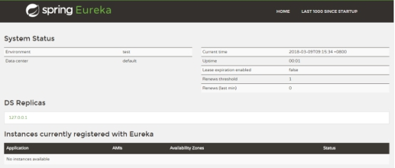
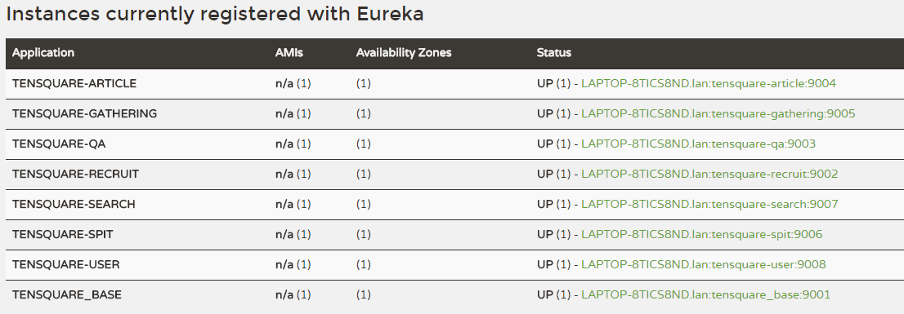

# 第7章-SpringCloud之初入江湖  

学习目标：

- 能够说出SpringCloud包含的主要框架
- 能够使用服务发现组件Eureka
- 能够使用Feign实现服务间的调用
- 完成交友微服务开发


# 1 SpringCloud简介

## 1.1 什么是SpringCloud

​	Spring Cloud是一系列框架的有序集合。它利用Spring Boot的开发便利性巧妙地简化了分布式系统基础设施的开发，如服务发现注册、配置中心、消息总线、负载均衡、熔断器、数据监控等，都可以用Spring Boot的开发风格做到一键启动和部署。Spring并没有重复制造轮子，它只是将目前各家公司开发的比较成熟、经得起实际考验的服务框架组合起来，通过Spring Boot风格进行再封装屏蔽掉了复杂的配置和实现原理，最终给开发者留出了一套简单易懂、易部署和易维护的分布式系统开发工具包。

​	Spring Cloud项目的官方网址：[http://projects.spring.io/spring-cloud/](http://projects.spring.io/spring-cloud/)

## 1.2 SpringCloud与SpringBoot的关系

​	Spring Boot 是 Spring 的一套快速配置脚手架，可以基于Spring Boot 快速开发单个微服务，Spring Cloud是一个基于Spring Boot实现的云应用开发工具；Spring Boot专注于快速、方便集成的单个微服务个体，Spring Cloud关注全局的服务治理框架；Spring Boot使用了默认大于配置的理念，很多集成方案已经帮你选择好了，能不配置就不配置，Spring Cloud很大的一部分是基于Spring Boot来实现，可以不基于Spring Boot吗？不可以。

​	Spring Boot可以离开Spring Cloud独立使用开发项目，但是Spring Cloud离不开Spring Boot，属于依赖的关系。

## 1.3 SpringCloud主要框架

- 服务发现——Netflix Eureka
- 服务调用——Netflix Feign
- 熔断器——Netflix Hystrix
- 服务网关——Netflix Zuul
- 分布式配置——Spring Cloud Config
- 消息总线   —— Spring Cloud Bus

## 1.4 Spring Cloud和Dubbo对比 

​      或许很多人会说Spring Cloud和Dubbo的对比有点不公平，Dubbo只是实现了服务治理，而Spring Cloud下面有17个子项目（可能还会新增）分别覆盖了微服务架构下的方方面面，服务治理只是其中的一个方面，一定程度来说，Dubbo只是Spring Cloud Netflix中的一个子集。

|        | Dubbo     | Spring Cloud                 |
| ------ | --------- | ---------------------------- |
| 服务注册中心 | Zookeeper | Spring Cloud Netflix Eureka  |
| 服务调用方式 | RPC       | REST API                     |
| 服务网关   | 无         | Spring Cloud Netflix Zuul    |
| 熔断器    | 不完善       | Spring Cloud Netflix Hystrix |
| 分布式配置  | 无         | Spring Cloud Config          |
| 服务跟踪   | 无         | Spring Cloud Sleuth          |
| 消息总线   | 无         | Spring Cloud Bus             |
| 数据流    | 无         | Spring Cloud Stream          |
| 批量任务   | 无         | Spring Cloud Task            |
| ……     | ……        | ……                           |


## 1.5 说说SpringCloud的版本

我们目前课程采用的SpringCloud版本为Finchley.M9  。你可能会觉得这个版本怎么这么奇怪？SpringCloud由于是一系列框架组合，为了避免与包含的自框架版本产生混淆，采用伦敦地铁站的名称作为版本名，形式为版本名+里程碑号。  M9为第9个里程碑版本。

以下是SpringBoot与Spring Cloud版本的对照表，大家看看有没有找到什么规律呢？

| Spring Boot | Spring Cloud        |
| ----------- | ------------------- |
| 1.2.x       | Angel版本             |
| 1.3.x       | Brixton版本           |
| 1.4.x       | Camden版本            |
| 1.5.x       | Dalston版本、Edgware版本 |
| 2.0.x       | Finchley版本          |


# 2 服务发现组件 Eureka

## 2.1 Eureka

​	Eureka是Netflix开发的服务发现框架，SpringCloud将它集成在自己的子项目spring-cloud-netflix中，实现SpringCloud的服务发现功能。Eureka包含两个组件：Eureka Server和Eureka Client。

​	Eureka Server提供服务注册服务，各个节点启动后，会在Eureka Server中进行注册，这样EurekaServer中的服务注册表中将会存储所有可用服务节点的信息，服务节点的信息可以在界面中直观的看到。

​	Eureka Client是一个java客户端，用于简化与Eureka Server的交互，客户端同时也就别一个内置的、使用轮询(round-robin)负载算法的负载均衡器。在应用启动后，将会向Eureka Server发送心跳,默认周期为30秒，如果Eureka Server在多个心跳周期内没有接收到某个节点的心跳，Eureka Server将会从服务注册表中把这个服务节点移除(默认90秒)。

​	Eureka Server之间通过复制的方式完成数据的同步，Eureka还提供了客户端缓存机制，即使所有的Eureka Server都挂掉，客户端依然可以利用缓存中的信息消费其他服务的API。综上，Eureka通过心跳检查、客户端缓存等机制，确保了系统的高可用性、灵活性和可伸缩性。

## 2.2 Eureka服务端开发

（1）创建tensquare_eureka模块

（2）引入依赖  父工程pom.xml定义SpringCloud版本

```xml
    <dependencyManagement>
        <dependencies>
            <dependency>
                <groupId>org.springframework.cloud</groupId>
                <artifactId>spring-cloud-dependencies</artifactId>
                <version>Finchley.M9</version>
                <type>pom</type>
                <scope>import</scope>
            </dependency>
        </dependencies>
    </dependencyManagement>
```

tensquare_eureka模块pom.xml引入eureka-server

```xml
    <dependencies>
        <dependency>
            <groupId>org.springframework.cloud</groupId>
            <artifactId>spring-cloud-starter-netflix-eureka-server</artifactId>
        </dependency>
    </dependencies>
```

（2）添加application.yml 

```yaml
server:
  port: 6868 #服务端口
eureka:
  client:
    registerWithEureka: false #是否将自己注册到Eureka服务中，本身就是所有无需注册
    fetchRegistry: false #是否从Eureka中获取注册信息
    serviceUrl: #Eureka客户端与Eureka服务端进行交互的地址
      defaultZone: http://127.0.0.1:${server.port}/eureka/
```

（3）编写启动类

创建包com.tensquare.eureka ，包下建立类

```java
@SpringBootApplication
@EnableEurekaServer
public class EurekaServer {
    public static void main(String[] args) {
        SpringApplication.run(EurekaServer.class, args);
    }
}
```

（4）启动运行启动类，然后在浏览器地址栏输入  http://localhost:6868/  运行效果如下：

  

主界面中system status为系统信息  General Info为一般信息  Instances currently registered with Eureka为注册到的所有微服务列表

## 2.3 服务注册

我们现在就将所有的微服务都注册到Eureka中，这样所有的微服务之间都可以互相调用了。

（1）将其他微服务模块添加依赖

```xml
		<dependency>
			<groupId>org.springframework.cloud</groupId>
			<artifactId>spring-cloud-starter-netflix-eureka-client</artifactId>
		</dependency>
```

（2）修改每个微服务的application.yml，添加注册eureka服务的配置

```yaml
eureka:
  client:
    service-url:
      defaultZone: http://localhost:6868/eureka
  instance:
    prefer-ip-address: true
```

（3）修改每个服务类的启动类，添加注解

```java
@EnableEurekaClient
```

（4）启动测试：将每个微服务启动起来，会发现eureka的注册列表中可以看到这些微服务了 

 

## 2.4 保护模式

如果在Eureka Server的首页看到以下这段提示，则说明Eureka已经进入了保护模式：


Eureka Server在运行期间，会统计心跳失败的比例在15分钟之内是否低于85%，如果出现低于的情况（在单机调试的时候很容易满足，实际在生产环境上通常是由于网络不稳定导致），Eureka Server会将当前的实例注册信息保护起来，同时提示这个警告。保护模式主要用于一组客户端和Eureka Server之间存在网络分区场景下的保护。一旦进入保护模式，Eureka Server将会尝试保护其服务注册表中的信息，不再删除服务注册表中的数据（也就是不会注销任何微服务）。

# 3 Feign实现服务间的调用

## 3.1 Feign简介

​	Feign是简化Java HTTP客户端开发的工具（java-to-httpclient-binder），它的灵感来自于[Retrofit](https://github.com/square/retrofit)、[JAXRS-2.0](https://jax-rs-spec.java.net/nonav/2.0/apidocs/index.html)和[WebSocket](http://www.oracle.com/technetwork/articles/java/jsr356-1937161.html)。Feign的初衷是降低统一绑定[Denominator](https://github.com/Netflix/Denominator)到HTTP API的复杂度，不区分是否为restful。

## 3.2 快速体验

我们现在在问答微服务调用基础微服务的方法（根据ID查询标签）

（1）在tensquare_qa模块添加依赖

```xml
		<dependency>
			<groupId>org.springframework.cloud</groupId>
			<artifactId>spring-cloud-starter-openfeign</artifactId>
		</dependency>
```

（2）修改tensquare_qa模块的启动类，添加注解

```java
@EnableDiscoveryClient
@EnableFeignClients
```

（3）在tensquare_qa模块创建 com.tensquare.qa.client包，包下创建接口

```java
@FeignClient("tensquare-base")
public interface LabelClient {

    @RequestMapping(value="/label/{id}", method = RequestMethod.GET)
    public Result findById(@PathVariable("id") String id);
}
```

@FeignClient注解用于指定从哪个服务中调用功能  ，***注意***  里面的名称与被调用的服务名保持一致，并且不能包含下划线。

@RequestMapping注解用于对被调用的微服务进行地址映射。***注意***   @PathVariable注解一定要指定参数名称，否则出错

（5）修改tensquare_qa模块的  ProblemController

```java
	@Autowired
	private LabelClient labelClient;

	@RequestMapping(value = "/label/{labelid}")
	public Result findLabelById(@PathVariable  String labelid){
		Result result = labelClient.findById(labelid);
		return result;
	}
```

（6）测试：http://localhost:9003/problem/label/1  能看到标签的信息

## 3.3 负载均衡

测试：同时开启多个基础微服务，看是否是轮流调用。

修改tensquare_base工程LabelController的findById方法

```java
    @RequestMapping(value="/{id}", method = RequestMethod.GET)
    public Result findById(@PathVariable String id){
        System.out.println("No.1");
        return new Result(true,StatusCode.OK,"查询成功",labelService.findById(id)  );
    }
```

启动基础微服务后，修改端口和输出信息，再次启动基础微服务

启动问答微服务，浏览器执行http://localhost:9003/problem/label/1   看是否轮流启动。


# 4 交友微服务开发 

## 4.1 需求分析 


好友表：

| 好友表      | tb_friend |      |                |
| -------- | --------- | ---- | -------------- |
| 字段名称     | 字段含义      | 字段类型 | 备注             |
| userid   | 用户ID      | 文本   |                |
| friendid | 好友ID      | 文本   |                |
| islike   | 是否互相喜欢    | 文本   | 0：单向喜欢  1：互相喜欢 |

非好友表：

| 好友表      | tb_nofriend |      |      |
| -------- | ----------- | ---- | ---- |
| 字段名称     | 字段含义        | 字段类型 | 备注   |
| userid   | 用户ID        | 文本   |      |
| friendid | 好友ID        | 文本   |      |


交友微服务本身的功能:

（1）当用户登陆后在推荐好友列表中点击“心”，表示喜欢此人 ，在数据库tb_friend表中插入一条数据，islike 为0

（2）当你点击了喜欢过的人，也喜欢了你 , 表示互粉成功！也向tb_friend表中插入一条数据，islike为1 ，并且将你喜欢她的数据islike也修改为1 

（3）当你点击了不喜欢某人（点击了叉），向tb_nofriend添加记录.

（4）当两个人互粉后，其中一人不喜欢对方了，删除好友表中的记录 ，向非好友表中添加记录


什么场景下使用springCloud呢？

我们来看用户表，有两列：  fanscount 表示粉丝数  ，followcount表示关注数

（1）当用户点击了喜欢：

比如小宝关注了楚楚，小宝的followcount（关注数）加1  ， 楚楚的fanscount （粉丝数）加1

（2）当用户删除了好友：

比如楚楚删除了好友小宝，小宝的fanscount （粉丝数）减1 ，楚楚的followcount（关注数）减1


## 4.2 交友微服务-添加与删除好友  

### 4.2.1 模块搭建  

（1）创建工程tensquare_friend，pom.xml引入依赖

```xml
    <dependencies>
        <dependency>
            <groupId>org.springframework.boot</groupId>
            <artifactId>spring-boot-starter-data-jpa</artifactId>
        </dependency>
        <dependency>
            <groupId>mysql</groupId>
            <artifactId>mysql-connector-java</artifactId>
        </dependency>
        <dependency>
            <groupId>com.tensquare</groupId>
            <artifactId>tensquare_common</artifactId>
            <version>1.0-SNAPSHOT</version>
        </dependency>
        <dependency>
            <groupId>org.springframework.boot</groupId>
            <artifactId>spring-boot-starter-data-redis</artifactId>
        </dependency>
        <dependency>
            <groupId>org.springframework.cloud</groupId>
            <artifactId>spring-cloud-starter-netflix-eureka-client</artifactId>
        </dependency>
      	<dependency>
			<groupId>org.springframework.cloud</groupId>
			<artifactId>spring-cloud-starter-openfeign</artifactId>
		</dependency>
    </dependencies>
```

（2）创建application.yml 

```yaml
server: 
  port: 9010
spring: 
  application:  
    name: tensquare-friend #指定服务名
  datasource:  
    driverClassName: com.mysql.jdbc.Driver
    url: jdbc:mysql://192.168.184.134:3306/tensquare_friend?characterEncoding=utf-8
    username: root
    password: 123456
  jpa: 
    database: MySQL
    show-sql: true
jwt:
 config:
    key: itcast
eureka:
  client:
    service-url:
      defaultZone: http://localhost:6868/eureka
  instance:
    prefer-ip-address: true
```

（3）编写启动类

```java
@SpringBootApplication
@EnableEurekaClient
@EnableDiscoveryClient
@EnableFeignClients
public class Application {

	public static void main(String[] args) {
		SpringApplication.run(Application.class, args);
	}

	@Bean
	public IdWorker idWorkker(){
		return new IdWorker(1, 1);
	}

	@Bean
	public JwtUtil jwtUtil(){
		return new util.JwtUtil();
	}
	
}
```

（4）创建JwtFilter（参见User工程）

（5）创建ApplicationConfig（参见User工程）

### 4.2.2 添加好友  

（1）创建实体类

```java
@Entity
@Table(name="tb_friend")
@IdClass(Friend.class)
public class Friend implements Serializable {
    @Id
    private String userid;

    @Id
    private String friendid;

    public String getUserid() {
        return userid;
    }

    public void setUserid(String userid) {
        this.userid = userid;
    }

    public String getFriendid() {
        return friendid;
    }

    public void setFriendid(String friendid) {
        this.friendid = friendid;
    }
}
```

（2）新建dao包，创建FriendDao接口

```java
/**
 * 交友数据访问层
 */
public interface FriendDao extends JpaRepository<Friend,String> {

    /**
     * 根据用户ID与被关注用户ID查询记录个数
     * @param userid
     * @param friendid
     * @return
     */
    @Query("select count(f) from Friend f where f.userid=?1 and f.friendid=?2")
    public int selectCount(String userid,String friendid);


    /**
     * 更新为互相喜欢
     * @param userid
     * @param friendid
     */
    @Modifying
    @Query("update Friend f  set f.islike=?3 where f.userid=?1 and f.friendid=?2")
    public void updateLike(String userid,String friendid,String islike);

}
```

（3）创建业务逻辑类

创建com.tensquare.friend.service包，包下建立类FriendService

```java
@Service
public class FriendService {

    @Autowired
    private FriendDao friendDao;

    @Transactional
    public int addFriend(String userid,String friendid){

        //判断如果用户已经添加了这个好友，则不进行任何操作,返回0
        if(friendDao.selectCount(userid, friendid)>0){
            return 0;
        }
        //向喜欢表中添加记录
        Friend friend=new Friend();
        friend.setUserid(userid);
        friend.setFriendid(friendid);
        friend.setIslike("0");
        friendDao.save(friend);

        //判断对方是否喜欢你，如果喜欢，将islike设置为1
        if(friendDao.selectCount( friendid,userid)>0){
            friendDao.updateLike(userid,friendid,"1");
            friendDao.updateLike(friendid,userid,"1");
        }
        return 1;
    }
}
```

（3）控制器类

创建包com.tensquare.friend.controller，包下创建FriendController

```java
@RestController
@RequestMapping("/friend")
public class FriendController {

    @Autowired
    private FriendService friendService;

    @Autowired
    private HttpServletRequest request;

    /**
     *  添加好友
     * @param friendid 对方用户ID
     * @param type  1：喜欢 0：不喜欢
     * @return
     */
    @RequestMapping(value="/like/{friendid}/{type}",method= RequestMethod.PUT)
    public Result addFriend(@PathVariable String friendid , @PathVariable String type){

        Claims claims=(Claims)request.getAttribute("user_claims");
        if(claims==null){
            return new Result(false, StatusCode.ACCESSERROR,"无权访问");
        }
        //如果是喜欢
        if(type.equals("1")){
            if(friendService.addFriend(claims.getId(),friendid)==0){
                return new Result(false, StatusCode.REPERROR,"已经添加此好友");
            }
        }else{
            //不喜欢
        }
        return new Result(true, StatusCode.OK, "操作成功");
    }
}
```

（4）测试：

​	启动用户微服务，登陆用户获取token

​	启动交友微服务，通过postMan测试  http://localhost:9010/friend/like/1/1,添加头信息  Authorization  内容为Bearer  加上获取的token.

### 4.2.3 添加非好友  

需求：当用户点击不喜欢某人，将对方的ID记录不喜欢列表中

（1）构建实体类

```java
@Entity
@Table(name="tb_nofriend")
@IdClass(NoFriend.class)
public class NoFriend implements Serializable {
    @Id
    private String userid;

    @Id
    private String friendid;


    public String getUserid() {
        return userid;
    }

    public void setUserid(String userid) {
        this.userid = userid;
    }

    public String getFriendid() {
        return friendid;
    }

    public void setFriendid(String friendid) {
        this.friendid = friendid;
    }
}
```

（2）创建数据访问接口

```java
/**
 * 不喜欢列表数据访问层
 */
public interface NoFriendDao extends JpaRepository<NoFriend,String> {

}
```

（3）修改业务逻辑类FriendService

```java
    @Autowired
    private NoFriendDao noFriendDao;

    /**
     * 向不喜欢列表中添加记录
     * @param userid
     * @param friendid
     */
    public void addNoFriend(String userid,String friendid){
        NoFriend noFriend=new NoFriend();
        noFriend.setUserid(userid);
        noFriend.setFriendid(friendid);
        noFriendDao.save(noFriend);
    }
```

（2）修改FriendController的addFriend方法

```java
    /**
     *  添加好友
     * @param friendid 对方用户ID
     * @param type  1：喜欢 0：不喜欢
     * @return
     */
    @RequestMapping(value="/like/{friendid}/{type}",method= RequestMethod.PUT)
    public Result addFriend(@PathVariable String friendid , @PathVariable String type){

        Claims claims=(Claims)request.getAttribute("user_claims");
        if(claims==null){
            return new Result(false, StatusCode.ACCESSERROR,"无权访问");
        }
        //如果是喜欢
        if(type.equals("1")){
            if(friendService.addFriend(claims.getId(),friendid)==0){
                return new Result(false, StatusCode.REPERROR,"已经添加此好友");
            }
        }else{
            //不喜欢
            friendService.addNoFriend(claims.getId(),friendid);//向不喜欢列表中添加记录
        }
        return new Result(true, StatusCode.OK, "操作成功");
    }
```

### 4.2.4 删除好友  

（1）FriendDao新增方法定义

```java
    /**
     * 删除喜欢
     * @param userid
     * @param friendid
     */
    @Modifying
    @Query("delete from Friend f where f.userid=?1 and f.friendid=?2")
    public void deleteFriend(String userid,String friendid);
```

（2）FriendService新增方法

```java
   /**
     * 删除好友
     * @param userid
     * @param friendid
     */
    @Transactional
    public void deleteFriend(String userid,String friendid){
        friendDao.deleteFriend(userid,friendid);
        friendDao.updateLike(friendid,userid,"0");
        addNoFriend(userid,friendid);//向不喜欢表中添加记录
    }
```

（3）FriendController新增方法

```java
    /**
     * 删除好友
     * @param friendid
     * @return
     */
    @RequestMapping(value="/{friendid}",method=RequestMethod.DELETE)
    public Result remove(@PathVariable String friendid){
        Claims claims=(Claims)request.getAttribute("user_claims");
        if(claims==null){
            return new Result(false, StatusCode.ACCESSERROR,"无权访问");
        }
        friendService.deleteFriend(claims.getId(), friendid);
        return new Result(true, StatusCode.OK, "删除成功");
    }
```

## 4.3 用户微服务-粉丝数与关注数的变更  

### 4.3.1 变更粉丝数  

（1）修改tensquare_user工程的UserDao，增加方法定义

```java
    /**
     * 更新粉丝数
     * @param userid 用户ID
     * @param x 粉丝数
     */
    @Modifying
    @Query("update User u set u.fanscount=u.fanscount+?2  where u.id=?1")
    public void incFanscount(String userid,int x);
```

（2）UserService增加方法

```java
	/**
	 *  更新粉丝数
	 * @param x
	 */
	@Transactional
	public void  incFanscount(String userid,int x){
		userDao.incFanscount(userid,x);
	}
```

（3）UserController增加方法

```java
	/**
	 *  增加粉丝数
	 * @param userid
	 * @param x
	 */
	@RequestMapping(value="/incfans/{userid}/{x}",method= RequestMethod.POST)
	public void incFanscount(@PathVariable String userid,@PathVariable int x){
		userService.incFanscount(userid,x);
	}
```

### 4.3.2 变更关注数  

（1）修改tensquare_user工程的UserDao，增加方法定义

```java
    /**
     * 更新关注数
     * @param userid 用户ID
     * @param x 粉丝数
     */
    @Modifying
    @Query("update User u set u.followcount=u.followcount+?2  where u.id=?1")
    public void incFollowcount(String userid,int x);
```

（2）UserService增加方法

```java
	/**
	 *  更新关注数
	 * @param x
	 */
	@Transactional
	public void  incFollowcount(String userid,int x){
		userDao.incFollowcount(userid,x);
	}
```

（3）UserController增加方法

```Java
	/**
	 *  增加关注数
	 * @param userid
	 * @param x
	 */
	@RequestMapping(value="/incfollow/{userid}/{x}",method= RequestMethod.POST)
	public void incFollowcount(@PathVariable String userid,@PathVariable int x){
		userService.incFollowcount(userid,x);
	}
```


## 4.4 调用用户微服务  

### 4.4.1 喜欢某人更新用户数据  

（1）在tensquare_friend模块创建 com.tensquare.friend.client包，包下创建接口

```java
/**
 * 用户客户端
 */
@FeignClient("tensquare-user")
public interface UserClient {

    /**
     *  增加粉丝数
     * @param userid
     * @param x
     */
    @RequestMapping(value="/user/incfans/{userid}/{x}",method= RequestMethod.POST)
    public void incFanscount(@PathVariable("userid") String userid, @PathVariable("x") int x);

    /**
     *  增加关注数
     * @param userid
     * @param x
     */
    @RequestMapping(value="/user/incfollow/{userid}/{x}",method= RequestMethod.POST)
    public void incFollowcount(@PathVariable("userid") String userid,@PathVariable("x") int x);

}
```

@FeignClient注解用于指定从哪个服务中调用功能  

@RequestMapping注解用于对被调用的微服务进行地址映射。

***注意***   @PathVariable注解一定要指定参数名称，否则出错

（2）修改FriendService ，注入UserClient

```java
 @Autowired
 private UserClient userClient;
```

​          修改addFriend方法,增加对userClient方法的调用

```java
 userClient.incFollowcount(userid,1);//增加自己的关注数
 userClient.incFanscount(friendid,1);//增加对方的粉丝数
```

### 4.4.2 删除好友更新用户数据 

修改FriendService的deleteFriend方法 ,增加调用

```java
 userClient.incFollowcount(userid,-1);//减少自己的关注数
 userClient.incFanscount(friendid,-1);//减少对方的粉丝数
```


# 面试问题

## 你在项目中使用SpringCloud的哪些组件?

服务注册组件Eureka  服务发现组件Feign 熔断器   网关  SpringCloudConfig (集中配置管理) SpringCloudBus(消息总线)

## 你在项目中哪个业务场景使用到微服务间的调用

交友微服务  添加好友，在交友微服务中调用用户微服务的更改粉丝数与关注数的方法。