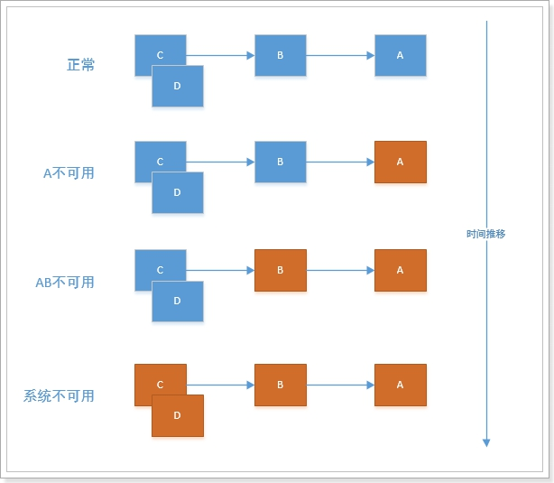
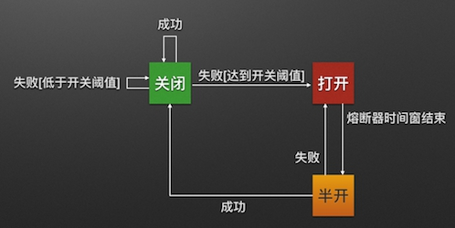
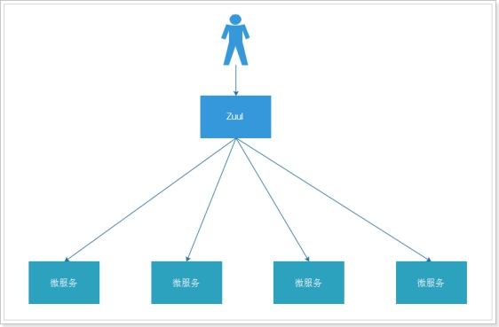
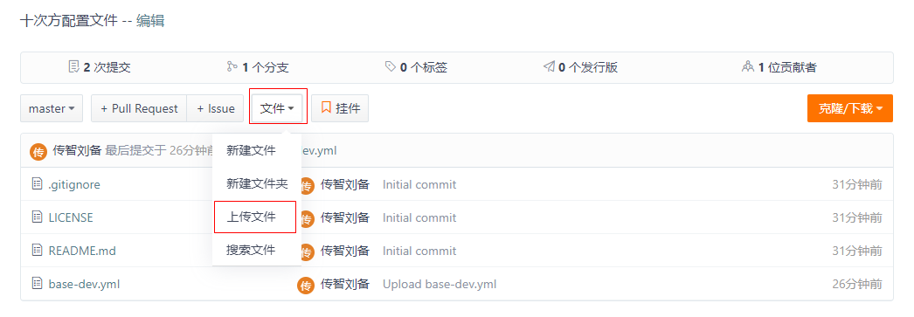
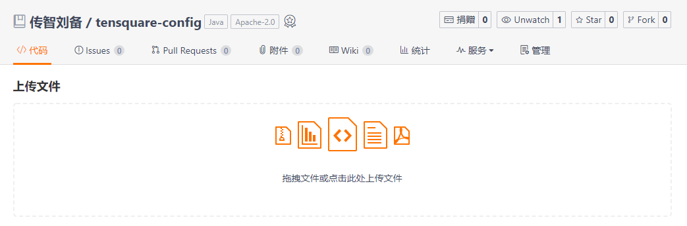
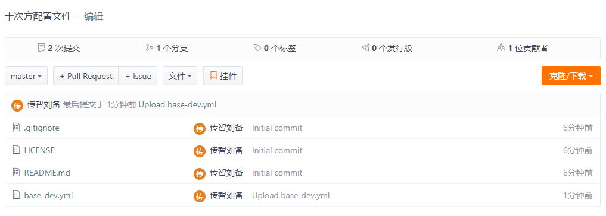
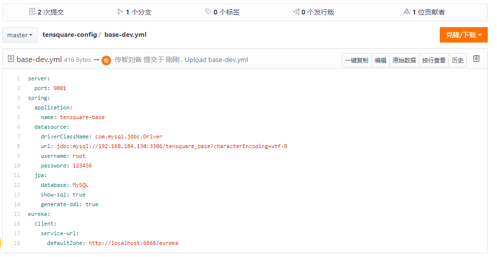
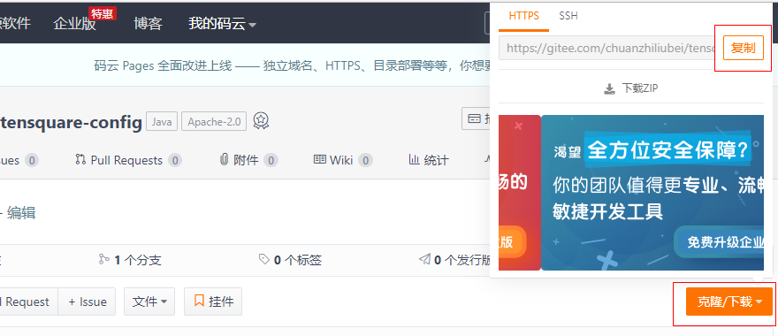
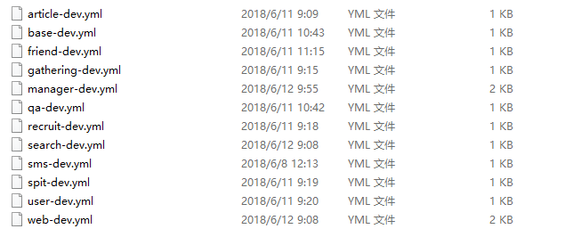

# 第8章-SpringCloud之一统天下  

学习目标：


# 1 熔断器Hystrix

## 1.1 为什么要使用熔断器

​	在微服务架构中通常会有多个服务层调用，基础服务的故障可能会导致级联故障，进而造成整个系统不可用的情况，这种现象被称为服务雪崩效应。服务雪崩效应是一种因“服务提供者”的不可用导致“服务消费者”的不可用,并将不可用逐渐放大的过程。

​	如果下图所示：A作为服务提供者，B为A的服务消费者，C和D是B的服务消费者。A不可用引起了B的不可用，并将不可用像滚雪球一样放大到C和D时，雪崩效应就形成了。

 

​	如何避免产生这种雪崩效应呢？我们可以使用Hystrix来实现熔断器。

## 1.2 什么是Hystrix 

**Hystrix** [hɪst'rɪks]的中文含义是豪猪, 因其背上长满了刺,而拥有自我保护能力		 

​	Hystrix 能使你的系统在出现依赖服务失效的时候，通过隔离系统所依赖的服务，防止服务级联失败，同时提供失败回退机制，更优雅地应对失效，并使你的系统能更快地从异常中恢复。

​	了解熔断器模式请看下图：



## 1.3 快速体验

Feign 本身支持Hystrix，不需要额外引入依赖。

（1）修改tensquare_qa模块的application.yml ，开启hystrix

```yaml
feign:
  hystrix:
    enabled: true
```

（2）在com.tensquare.qa.client包下创建impl包，包下创建熔断实现类，实现自接口LabelClient

```java
@Component
public class LabelClientImpl implements LabelClient {

    @Override
    public Result findById(String id) {
        return new Result(false, StatusCode.ERROR,"熔断器启动了");
    }
}
```

（3）修改LabelClient的注解  

```java
@FeignClient(value="tensquare-base",fallback = LabelClientImpl.class)
```

（4）测试运行

重新启动问答微服务，测试看熔断器是否运行。

# 2 微服务网关Zuul

## 2.1 为什么需要微服务网关 

不同的微服务一般有不同的网络地址，而外部的客户端可能需要调用多个服务的接口才能完成一个业务需求。比如一个电影购票的收集APP,可能回调用电影分类微服务，用户微服务，支付微服务等。如果客户端直接和微服务进行通信，会存在一下问题：

\# 客户端会多次请求不同微服务，增加客户端的复杂性

\# 存在跨域请求，在一定场景下处理相对复杂

\# 认证复杂，每一个服务都需要独立认证

\# 难以重构，随着项目的迭代，可能需要重新划分微服务，如果客户端直接和微服务通信，那么重构会难以实施

\# 某些微服务可能使用了其他协议，直接访问有一定困难

上述问题，都可以借助微服务网关解决。微服务网关是介于客户端和服务器端之间的中间层，所有的外部请求都会先经过微服务网关。

## 2.2 什么是Zuul

​	Zuul是Netflix开源的微服务网关，他可以和Eureka,Ribbon,Hystrix等组件配合使用。Zuul组件的核心是一系列的过滤器，这些过滤器可以完成以下功能：

\# 身份认证和安全: 识别每一个资源的验证要求，并拒绝那些不符的请求

\#审查与监控：

\## 动态路由：动态将请求路由到不同后端集群

\# 压力测试：逐渐增加指向集群的流量，以了解性能

\# 负载分配：为每一种负载类型分配对应容量，并弃用超出限定值的请求

\# 静态响应处理：边缘位置进行响应，避免转发到内部集群

\# 多区域弹性：跨域AWS Region进行请求路由，旨在实现ELB(ElasticLoad Balancing)使用多样化

Spring Cloud对Zuul进行了整合和增强。

使用Zuul后，架构图演变为以下形式



## 2.3 Zuul路由转发 

### 2.3.1 管理后台微服务网关 

（1）创建子模块tensquare_manager，pom.xml引入eureka-client 和zuul的依赖

```xml
    <dependencies>
        <dependency>
            <groupId>org.springframework.cloud</groupId>
            <artifactId>spring-cloud-starter-netflix-eureka-client</artifactId>
        </dependency>
        <dependency>
            <groupId>org.springframework.cloud</groupId>
            <artifactId>spring-cloud-starter-netflix-zuul</artifactId>
        </dependency>
    </dependencies>
```

（2）创建application.yml

```yaml
server:
  port: 9011
spring:
  application:
    name: tensquare-manager #指定服务名
eureka:
  client:
    serviceUrl: #Eureka客户端与Eureka服务端进行交互的地址
      defaultZone: http://127.0.0.1:6868/eureka/
  instance:
    prefer-ip-address: true
zuul:
  routes:
    tensquare-gathering: #活动
      path: /gathering/** #配置请求URL的请求规则
      serviceId: tensquare-gathering #指定Eureka注册中心中的服务id
    tensquare-article: #文章
      path: /article/** #配置请求URL的请求规则
      serviceId: tensquare-article #指定Eureka注册中心中的服务id
    tensquare-base: #基础
      path: /base/** #配置请求URL的请求规则
      serviceId: tensquare-base #指定Eureka注册中心中的服务id
    tensquare-friend: #交友
      path: /friend/** #配置请求URL的请求规则
      serviceId: tensquare-friend #指定Eureka注册中心中的服务id 
    tensquare-qa: #问答
      path: /qa/** #配置请求URL的请求规则
      serviceId: tensquare-qa #指定Eureka注册中心中的服务id 
    tensquare-recruit: #招聘
      path: /recruit/** #配置请求URL的请求规则
      serviceId: tensquare-recruit #指定Eureka注册中心中的服务id          
    tensquare-spit: #吐槽
      path: /spit/** #配置请求URL的请求规则
      serviceId: tensquare-spit #指定Eureka注册中心中的服务id      
    tensquare-user: #用户
      path: /user/** #配置请求URL的请求规则
      serviceId: tensquare-user #指定Eureka注册中心中的服务id
```

（3）编写启动类

```java
@EnableZuulProxy
@SpringBootApplication
public class Application {
    public static void main(String[] args) {
        SpringApplication.run(Application.class, args);
    }
}
```

### 2.3.2 网站前台的微服务网关 

（1）创建子模块tensquare_web，pom.xml引入依赖zuul

```xml
    <dependencies>
        <dependency>
            <groupId>org.springframework.cloud</groupId>
            <artifactId>spring-cloud-starter-netflix-eureka-client</artifactId>
        </dependency>
        <dependency>
            <groupId>org.springframework.cloud</groupId>
            <artifactId>spring-cloud-starter-netflix-zuul</artifactId>
        </dependency>
    </dependencies>
```

（2）创建application.yml 

```yaml
server:
  port: 9012
spring:
  application:
    name: tensquare-web #指定服务名
eureka:
  client:
    serviceUrl: #Eureka客户端与Eureka服务端进行交互的地址
      defaultZone: http://127.0.0.1:6868/eureka/
  instance:
    prefer-ip-address: true
zuul:
  routes:
    tensquare-gathering: #活动
      path: /gathering/** #配置请求URL的请求规则
      serviceId: tensquare-gathering #指定Eureka注册中心中的服务id
    tensquare-article: #文章
      path: /article/** #配置请求URL的请求规则
      serviceId: tensquare-article #指定Eureka注册中心中的服务id
    tensquare-base: #基础
      path: /base/** #配置请求URL的请求规则
      serviceId: tensquare-base #指定Eureka注册中心中的服务id
    tensquare-friend: #交友
      path: /friend/** #配置请求URL的请求规则
      serviceId: tensquare-friend #指定Eureka注册中心中的服务id
    tensquare-qa: #问答
      path: /qa/** #配置请求URL的请求规则
      serviceId: tensquare-qa #指定Eureka注册中心中的服务id
    tensquare-recruit: #招聘
      path: /recruit/** #配置请求URL的请求规则
      serviceId: tensquare-recruit #指定Eureka注册中心中的服务id
    tensquare-spit: #吐槽
      path: /spit/** #配置请求URL的请求规则
      serviceId: tensquare-spit #指定Eureka注册中心中的服务id
    tensquare-user: #用户
      path: /user/** #配置请求URL的请求规则
      serviceId: tensquare-user #指定Eureka注册中心中的服务id
    tensquare-search: #用户
      path: /search/** #配置请求URL的请求规则
      serviceId: tensquare-search #指定Eureka注册中心中的服务id
```

（3）编写启动类

```java
@EnableZuulProxy
@SpringBootApplication
public class WebApplication {

    public static void main(String[] args) {
        SpringApplication.run(WebApplication.class);
    }
}
```

## 2.4 Zuul过滤器 

### 2.4.1 Zuul过滤器快速体验 

我们现在在tensquare_web 创建一个简单的zuul过滤器

```Java
@Component
public class WebFilter extends ZuulFilter {

    @Override
    public String filterType() {
         return "pre";// 前置过滤器
    }

    @Override
    public int filterOrder() {
        return 0;// 优先级为0，数字越大，优先级越低
    }

    @Override
    public boolean shouldFilter() {
        return true;// 是否执行该过滤器，此处为true，说明需要过滤
    }

    @Override
    public Object run() throws ZuulException {
        System.out.println("zuul过滤器...");
        return null;
    }
}
```

启动tensquare_web会发现过滤器已经执行

filterType：返回一个字符串代表过滤器的类型，在zuul中定义了四种不同生命周期的过滤器类型，具体如下：

- `pre`：可以在请求被路由之前调用
- `route`：在路由请求时候被调用
- `post`：在route和error过滤器之后被调用
- `error`：处理请求时发生错误时被调用

`filterOrder`：通过int值来定义过滤器的执行顺序

`shouldFilter`：返回一个boolean类型来判断该过滤器是否要执行，所以通过此函数可实现过滤器的开关。在上例中，我们直接返回true，所以该过滤器总是生效

`run`：过滤器的具体逻辑。

### 2.4.2 网站前台的token转发 

我们现在在过滤器中接收header，转发给微服务

修改tensquare_web的过滤器。如果有token，直接转发。

```java
    @Override
    public Object run() throws ZuulException {
        System.out.println("zuul过滤器...");
        //向header中添加鉴权令牌
        RequestContext requestContext = RequestContext.getCurrentContext();
        //获取header
        HttpServletRequest request = requestContext.getRequest();
        String authorization = request.getHeader("Authorization");
        if(authorization!=null){
            requestContext.addZuulRequestHeader("Authorization",authorization);
        }
        return null;
    }
```

### 2.4.3 管理后台过滤器实现token校验 

修改tensquare_manager的过滤器,  因为是管理后台使用，所以需要在过滤器中对token进行验证。

（1）tensquare_manager引入tensquare_common依赖  ，因为需要用到其中的JWT工具类

```xml
        <dependency>
            <groupId>com.tensquare</groupId>
            <artifactId>tensquare_common</artifactId>
            <version>1.0-SNAPSHOT</version>
        </dependency>
```

（2）修改tensquare_manager配置文件application.yml

```yaml
jwt:
 config:
    key: itcast
```

（3）修改tensquare_manager的启动类,添加bean

```java
    @Bean
    public JwtUtil jwtUtil(){
        return new JwtUtil();
    }
```

（4）tensquare_manager编写过滤器类

```java
@Component
public class ManagerFilter extends ZuulFilter {

    @Autowired
    private JwtUtil jwtUtil;

    @Override
    public String filterType() {//过滤器类型
        return "pre";//前置过滤器
    }

    @Override
    public int filterOrder() {
        return 0;//优先级，数字越大，优先级越低
    }

    @Override
    public boolean shouldFilter() {
        return true;//过滤器开关，true表示开启
    }

    @Override
    public Object run() throws ZuulException {
        System.out.println("Zuul过滤器");
        RequestContext requestContext=RequestContext.getCurrentContext();
        HttpServletRequest request = requestContext.getRequest();
        
        if(request.getMethod().equals("OPTIONS")){
            return null;
        }
        String url=request.getRequestURL().toString();
        if(url.indexOf("/admin/login")>0){
            System.out.println("登陆页面"+url);
            return null;
        }

        String authHeader =(String)request.getHeader("Authorization");//获取头信息
        if(authHeader!=null && authHeader.startsWith("Bearer ") ){
            String token = authHeader.substring(7);
            Claims claims = jwtUtil.parseJWT(token);
            if(claims!=null){
                if("admin".equals(claims.get("roles"))){
                    requestContext.addZuulRequestHeader("Authorization",authHeader);
                    System.out.println("token 验证通过，添加了头信息"+authHeader);
                    return null;
                }
            }
        }
        requestContext.setSendZuulResponse(false);//终止运行
        requestContext.setResponseStatusCode(401);//http状态码
        requestContext.setResponseBody("无权访问");
        requestContext.getResponse().setContentType("text/html;charset=UTF-8");

        return null;
    }
}
```

需要注意，这里我们通过`ctx.setSendZuulResponse(false)`令zuul过滤该请求，不对其进行路由，然后通过`ctx.setResponseStatusCode(401)`设置了其返回的错误码


# 3 集中配置组件SpringCloudConfig 

## 3.1 Spring Cloud Config简介 

在分布式系统中，由于服务数量巨多，为了方便服务配置文件统一管理，实时更新，所以需要分布式配置中心组件。在Spring Cloud中，有分布式配置中心组件spring cloud config ，它支持配置服务放在配置服务的内存中（即本地），也支持放在远程Git仓库中。在spring cloud config 组件中，分两个角色，一是config server，二是config client。

Config Server是一个可横向扩展、集中式的配置服务器，它用于集中管理应用程序各个环境下的配置，默认使用Git存储配置文件内容，也可以使用SVN存储，或者是本地文件存储。

Config Client是Config Server的客户端，用于操作存储在Config Server中的配置内容。微服务在启动时会请求Config Server获取配置文件的内容，请求到后再启动容器。

详细内容看在线文档： https://springcloud.cc/spring-cloud-config.html

## 3.2 配置服务端 

### 3.2.1 将配置文件提交到码云 

使用GitHub时，国内的用户经常遇到的问题是访问速度太慢，有时候还会出现无法连接的情况。如果我们希望体验Git飞一般的速度，可以使用国内的Git托管服务——[码云](https://gitee.com/)（[gitee.com](https://gitee.com/)）。

和GitHub相比，码云也提供免费的Git仓库。此外，还集成了代码质量检测、项目演示等功能。对于团队协作开发，码云还提供了项目管理、代码托管、文档管理的服务。

步骤：

（1）浏览器打开gitee.com，注册用户 ，注册后登陆码云管理控制台


（2）创建项目  tensquare-config  (点击右上角的加号 ，下拉菜单选择创建项目)


（3）上传配置文件，将tensquare_base工程的application.yml改名为base-dev.yml后上传



可以通过拖拽的方式将文件上传上去



上传成功后列表可见



可以再次编辑此文件



文件命名规则：

{application}-{profile}.yml或{application}-{profile}.properties

application为应用名称 profile指的开发环境（用于区分开发环境，测试环境、生产环境等）

（4）复制git地址 ,备用



地址为：https://gitee.com/chuanzhiliubei/tensquare-config.git

### 3.2.2 配置中心微服务 

（1）创建工程模块 配置中心微服务  tensquare_config   ,pom.xml引入依赖

```xml
    <dependencies>
        <dependency>
            <groupId>org.springframework.cloud</groupId>
            <artifactId>spring-cloud-config-server</artifactId>
        </dependency>
    </dependencies>
```

（2）创建启动类ConfigServerApplication

```java
@EnableConfigServer //开启配置服务
@SpringBootApplication
public class ConfigServerApplication {
    public static void main(String[] args) {
        SpringApplication.run(ConfigServerApplication.class, args);
    }
}
```

（3）编写配置文件application.yml

```yaml
spring:
  application:
    name: tensquare-config
  cloud:
    config:
      server:
        git:
          uri: https://gitee.com/chuanzhiliubei/tensquare-config.git
server:
  port: 12000
```

（4）浏览器测试：http://localhost:12000/base-dev.yml 可以看到配置内容

## 3.3 配置客户端 

（1）在tensquare_base工程添加依赖

```xml
		<dependency>
		  <groupId>org.springframework.cloud</groupId>
		  <artifactId>spring-cloud-starter-config</artifactId>
		</dependency>
```

（2）添加bootstrap.yml ,删除application.yml 

```yaml
spring:
  cloud:
    config:
      name: base
      profile: dev
      label: master
      uri: http://127.0.0.1:12000
```

（3）测试： 启动工程tensquare_eureka   tensquare_config  tensquare_base，看是否可以正常运行

http://localhost:9001/label  

# 4 消息总线组件SpringCloudBus 

## 4.1 SpringCloudBus简介 

​	如果我们更新码云中的配置文件，那客户端工程是否可以及时接受新的配置信息呢？我们现在来做有一个测试，修改一下码云中的配置文件中mysql的端口  ，然后测试http://localhost:9001/label  数据依然可以查询出来，证明修改服务器中的配置并没有更新立刻到工程，只有重新启动程序才会读取配置。 那我们如果想在不重启微服务的情况下更新配置如何来实现呢?  我们使用SpringCloudBus来实现配置的自动更新。

## 4.2 代码实现

### 4.2.1 配置服务端 

（1）修改tensquare_config工程的pom.xml，引用依赖

```xml
        <dependency>
            <groupId>org.springframework.cloud</groupId>
            <artifactId>spring-cloud-bus</artifactId>
        </dependency>
        <dependency>
            <groupId>org.springframework.cloud</groupId>
            <artifactId>spring-cloud-stream-binder-rabbit</artifactId>
        </dependency>
```

（2）修改application.yml ，添加配置

```yaml
  rabbitmq:
    host: 192.168.184.135
management: #暴露触发消息总线的地址
  endpoints:
    web:
      exposure:
        include: bus-refresh
```

### 4.2.2 配置客户端 

我们还是以基础模块为例，加入消息总线

（1）修改tensquare_base工程 ，引入依赖

```xml
	  <dependency>
		  <groupId>org.springframework.cloud</groupId>
		  <artifactId>spring-cloud-bus</artifactId>
	  </dependency>
	  <dependency>
		  <groupId>org.springframework.cloud</groupId>
		  <artifactId>spring-cloud-stream-binder-rabbit</artifactId>
	  </dependency>
	  <dependency>
		  <groupId>org.springframework.boot</groupId>
		  <artifactId>spring-boot-starter-actuator</artifactId>
	  </dependency>
```

（2）在码云的配置文件中配置rabbitMQ的地址：

```yaml
  rabbitmq:
    host: 192.168.184.135
```

（2）启动tensquare_eureka  、tensquare_config和tensquare_base  看是否正常运行

（3）修改码云上的配置文件 ，将数据库连接IP  改为127.0.0.1  ，在本地部署一份数据库。

（4）postman测试    Url: http://127.0.0.1:12000/actuator/bus-refresh   Method: post  

（5）再次观察输出的数据是否是读取了本地的mysql数据。

### 4.2.3 自定义配置的读取 

（1）修改码云上的配置文件，增加自定义配置

```
sms:
  ip: 127.0.0.1
```

（2）在tensquare_base工程中新建controller

```java

@RestController
public class TestController {
    @Value("${sms.ip}")
    private String ip;

    @RequestMapping(value = "/ip", method = RequestMethod.GET)
    public String ip() {
        return ip;
    }
}
```

（3）运行测试看是否能够读取配置信息  ，OK.

（4）修改码云上的配置文件中的自定义配置

```
sms:
  ip: 192.168.184.134
```

（5）通过postman测试    Url: http://127.0.0.1:12000/actuator/bus-refresh   Method: post    

测试后观察,发现并没有更新信息。

这是因为我们的 controller少了一个注解@RefreshScope  此注解用于刷新配置

```java
@RefreshScope
@RestController
public class TestController {
    @Value("${sms.ip}")
    private String ip;

    @RequestMapping(value = "/ip", method = RequestMethod.GET)
    public String ip() {
        return ip;
    }
}
```

添加后再次进行测试。

### 4.2.4 完成十次方工程的配置集中管理 

步骤：

（1）将每一个工程的配置文件提取出来，重命名



（2）将这些文件上传到码云

（3）修改每一个微服务工程，pom.xml中添加依赖

```xml
       <dependency>
            <groupId>org.springframework.cloud</groupId>
            <artifactId>spring-cloud-starter-config</artifactId>
        </dependency>
        <dependency>
            <groupId>org.springframework.cloud</groupId>
            <artifactId>spring-cloud-bus</artifactId>
        </dependency>
        <dependency>
            <groupId>org.springframework.cloud</groupId>
            <artifactId>spring-cloud-stream-binder-rabbit</artifactId>
        </dependency>
        <dependency>
            <groupId>org.springframework.boot</groupId>
            <artifactId>spring-boot-starter-actuator</artifactId>
        </dependency>
```

（4）删除每一个微服务的application.yml

（5）为每一个微服务添加bootstrap.yml  （参考tesquare_base工程）

（6）修改码云上的配置文件添加rabbitmq地址

```
  rabbitmq:
    host: 192.168.184.135
```


# 面试问题总监

## 解释雪崩效应，为什么要使用熔断器


## 解释为什么使用微服务网关

（1）微服务工程统一入口，方便前端调用

（2）集中处理权限问题

## 解释为什么使用集中配置管理

将配置文件放到云端，方便后期维护


## 解释为什么使用消息总线

我们可以在不重启微服务的情况下，更新配置文件，让其立刻生效


